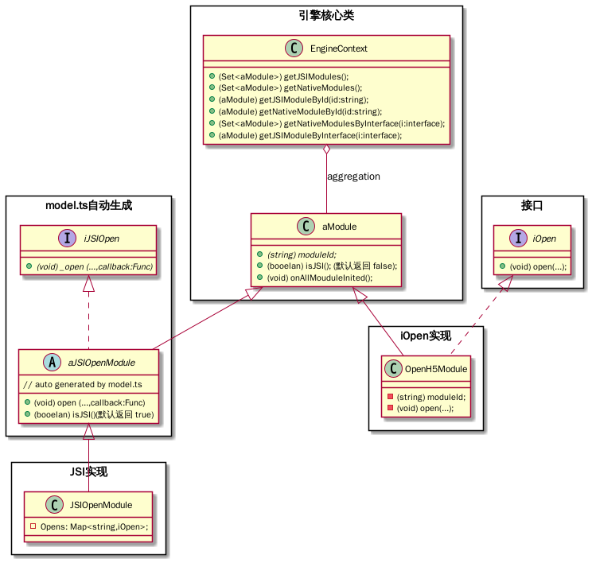

 

## 类图

### 情境 1

JSI 的实现不需要在原生里复用。（引擎最初版本），通常是仅供 JS 调用的模块。

 

 

### 情境 2

原生模块也需要使用这些功能。

>  注意 aJSIOpenModule 里的方法应该默认返回 true。

比如 Open 功能，我们可以实现 OpenH5Module，OpenNativeModule，OpenMicroAppModule。 这些都会被扫描。

我们约定原生模块的 id 应该以 native 开头。 如 native.com.zkty.module.open

而在 JSIOpenModule 里，在 afterAllNativeMouduleInited 回调生命周期里，可以调用引擎 EngineContext::getNativeModulesByInterface(iOPen);

即可以拿到 iOpen 的所有实现。将它们填加进 JSIOpenModule 里即可完成动态注入原生模块功能。

而当原生需要这些功能时，

### 情境 3

不关心 JSI ，只管理模块

- 引擎核心类： 

  各模块都将依赖

- model.ts 自动生成：

  将由 model.ts 通过 x-cli 生成

  i 代表 interface

  a 代表 abstract class

  JSI 代表 Javascript Interface

  > 要注意，在 iOS 里，扫描的是 aJSIOpen。 个中原因，oc 语言不支持重载。

- JSI 实现

  实现带下划线的抽象类方法

- 接口 与 iOpen 实现

  这两者可以独立由原生模块机制管理。