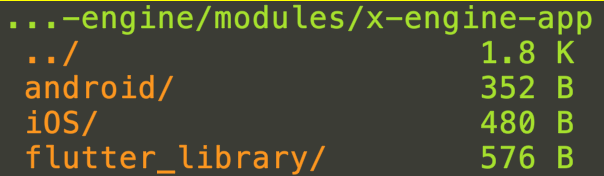

1. 安装最新的 flutter, 需要非常久.

   flutter upgrade

   

2. 创建 flutter 工程.

   flutter create -t module flutter_library

   


3. 在 flutter_library 里创建  podspec

   ```
   Pod::Spec.new do |s|
     s.name             = 'FlutterEngine'
     s.version          = '0.1.0'
     s.summary          = 'FlutterEngine'
     s.description      = <<-DESC
   TODO: Add long description of the pod here.
                          DESC
     s.homepage         = 'https://github.com/zkty-team/x-engine'
     s.license          = { :type => 'MIT', :file => 'LICENSE' }
     s.author           = { 'zk' => 'liuzq7@gmail.com' }
     s.source       = { :git => "", :tag => "#{s.version}" }
     s.ios.deployment_target = '9.0'
     s.ios.vendored_frameworks = 'App.framework', 'Flutter.framework'
   end
   
   ```

   

4. 修改 iOS 文件夹里的 Podfile 

   ```
   # Uncomment thj next line to define a global platform for your project
   #
   platform :ios, '10.0'
   
   flutter_application_path = '../flutter_library'
   load File.join(flutter_application_path, '.ios', 'Flutter', 'podhelper.rb')
   
    // ... 省略其他
    
   target 'ModuleApp' do
     install_all_flutter_pods(flutter_application_path)
     pod 'FlutterEngine', :path => '../flutter_library'
    // ... 省略其他
   end
    
   
   ```

   pod install

   

5. 编译 flutter_library

   ```
   cd flutter_library 
   flutter build ios --debug
   ```


6. 在自己的工程加个入口

   ```objective-c
   
   #import <FlutterPluginRegistrant/GeneratedPluginRegistrant.h>
   
   
   @interface ThreeViewController ()
   
   @end
   
   @implementation ThreeViewController
   
   - (void)viewDidLoad {
       [super viewDidLoad];
       self.navigationItem.title = @"flutter 3";
       UIButton *button = [[UIButton alloc]init];
          [button setTitle:@"加载Flutter模块" forState:UIControlStateNormal];
          button.backgroundColor=[UIColor redColor];
          button.frame = CGRectMake(50, 50, 200, 100);
          [button setTitleColor:[UIColor redColor] forState:UIControlStateHighlighted];
          [button addTarget:self action:@selector(buttonPrint) forControlEvents:UIControlEventTouchUpInside];
          [self.view addSubview:button];
   }
   
   - (void)buttonPrint{
       FlutterViewController * flutterVC = [[FlutterViewController alloc]init];
       [flutterVC setInitialRoute:@"defaultRoute"];
       [self presentViewController:flutterVC animated:true completion:nil];
   }
   ```


7. 运行真机,需要你的原工程是 release 模式, 并且, flutter_library 里的工程要用能上真机的证书

   


# 参考

跟着官网来
https://flutter.cn/docs/development/add-to-app/ios/project-setup


参考这哥:

https://segmentfault.com/a/1190000021634067