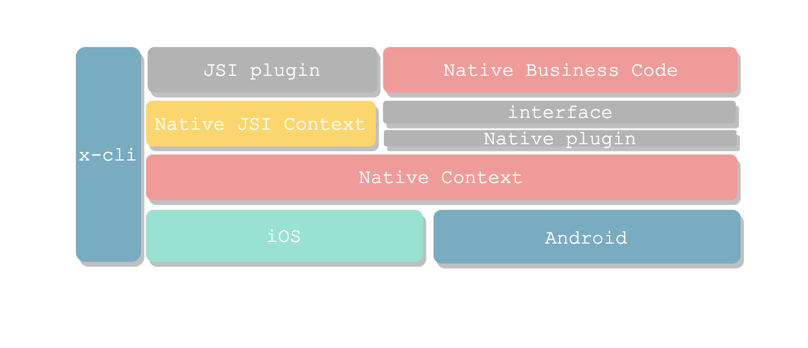
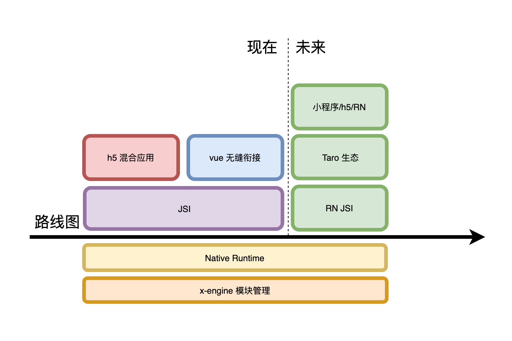

# X-engine 简介

x-engine 是一个跨端模块管理框架. 只做一件事，管理原生模块(iOS/android)。 所有其他功能特性均由 plugin 支撑。

你可以基于 x-engine 开发原生 App。也可以基于 x-engine 开发 react-native 与原生的混合。

基于 x-engine 我们要做的事：

1. 沉淀原生模块(Native Module),以支持多条业务线的前端产品。
2. 结合最新前端技术，提供整合方案支持。

<!-- tabs:start -->

## **当前架构图**

#### **类图**

<!-- tabs:end -->

x-engine 可以与各种跨平台框架融合.

跨平台框架: 总结下来就这几种模式：

native + h5  : cordova 

h5 -> native  : reactie-native  weex 

self-render   : flutter

native + web- : 小程序

没有谁好谁坏, 但在选择某个方案前,你都得关注这几个点:

项目目标, 可维护性, 可扩展性, 可协作性, 开发效率, 开发人员门槛, 开发技术的隔离.

cordova/capacitor/ionic 的问题在于, 它是以 h5 为主.原生为辅. 这就让原生很尴尬,最终会沦为插件转换器. 但 h5 也很尴尬,只要涉及到原生.完全摸不着北.

reactie-native  的问题在于, 它丢弃了 h5 很多东西. 如果你真又要开发效率又要原生性能.也许是个不错的选择.

flutter 就是更尴尬. 半路出家的 native 开发者去玩 flutter. 总有一种突然能先写两端的幻觉. 但出问题能不能 hold 住是个非常大的问号. 能不能 google 到答案基本是 99% flutter 开发人员的上限.

x-engine 的优势在于, 原生为主. 由原生主导. 充分利用社区已存在的功能.

x-engine 以 sdk 的形式集成. 而其他跨平台框架会以 sdk 的插件集成.也就代表对原生工程不会有侵入性. 

至于 UI 层你愿意用什么去做混合应用开发。完全由使用者决定。

## Next Step

保持简单，拥抱社区力量。 taro 的 UI 方案比较完善，且基于开源社区。将会基于 x-engine 做深度整合。

# 外部资源
[ve-charts](https://vueblocks.github.io/ve-charts/#/chart-wordcloud)
