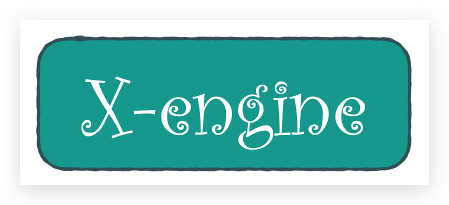
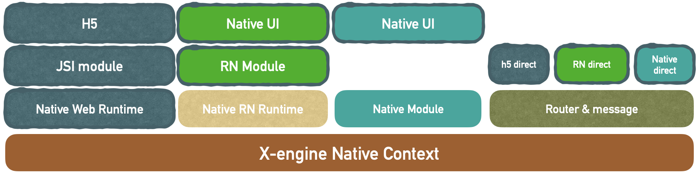

# X-engine 简介

x-engine 是一个跨端模块管理框架. 管理原生模块(iOS/android)。 所有其他功能特性均由 plugin 支撑。

你可以基于 x-engine 开发原生 App。也可以基于 x-engine 开发 react-native 与原生的混合。

但最终：我们还是要做 app 出来。

而 app = UI + 逻辑。

UI 层在最终呈现时，现在有 3 种方案

1. 原生 UI
   1. 纯原生
   2. React Native 生成原生组件
   3. Weex 生成原生组件
2. H5
3. 自制渲染引擎

逻辑分为，原生 api + 业务逻辑

业务逻辑一般都会跟 UI 层的解决方案走。

原生 UI 层社区如此繁荣。再造轮子就没必要了。 那我们的主要目标就比较清晰。

1. 怎么让 UI 层无缝路由。
2. 怎么打通原生 api 到各 UI 层。

<!-- tabs:start -->

## **架构图**

#### **类图**

<!-- tabs:end -->

## 一码多端？

不是我们考虑的事。

# 外部资源
[ve-charts](https://vueblocks.github.io/ve-charts/#/chart-wordcloud)
