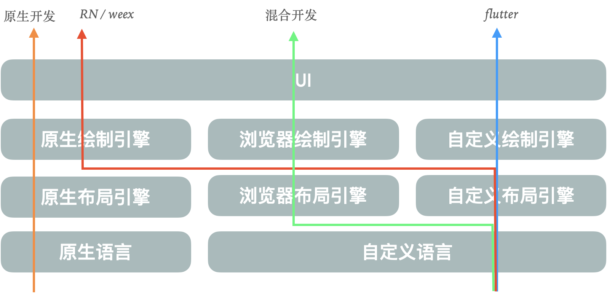
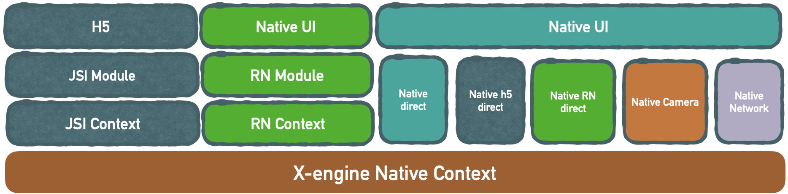

# X-engine 简介

x-engine 是一个跨端模块管理框架. 管理原生模块(iOS/android)。 所有其他功能特性均由 plugin 支撑。

你可以基于 x-engine 开发原生 App。也可以基于 x-engine 开发 react-native 与原生的混合。

但最终：我们都要做 app 出来。

而 app = UI + 逻辑。

UI 层在最终呈现时，现在有 4 种方案

1. 原生语言 -> 原生布局引擎 -> 原生绘制引擎  -> UI
2. 自定义语言 -> 浏览器布局引擎 -> 浏览器绘制引擎  -> UI，常见于 hybrid 方案
3. 自定义语言 -> 自定义布局引擎 -> 原生绘制引擎     -> UI，常见于 RN / weex 等这种方案
4. 自制引擎    -> 自定义布局引擎 -> 自定义绘制引擎  -> UI，常见于 flutter, crossapp 这种方案

原生 UI 层社区如此繁荣。再造轮子就没必要了。 那我们的主要目标就比较清晰。

1. 如果将 UI 层看作绘制模块。那也就回归到x-engine 主要的功能，管理模块。
2. UI 是比较特殊的模块，怎么让绘制模块间无缝路由。
3. 要支撑 UI 层，怎么让 api 层可复用到各 UI 层的功能调用。

<!-- tabs:start -->

## **架构图**

#### **类图**

<!-- tabs:end -->

  

## 小程序呢

小程序的支持不应该由 x-engine 解决。而应该由 UI 方案自己解决。比如，基于 taro。

