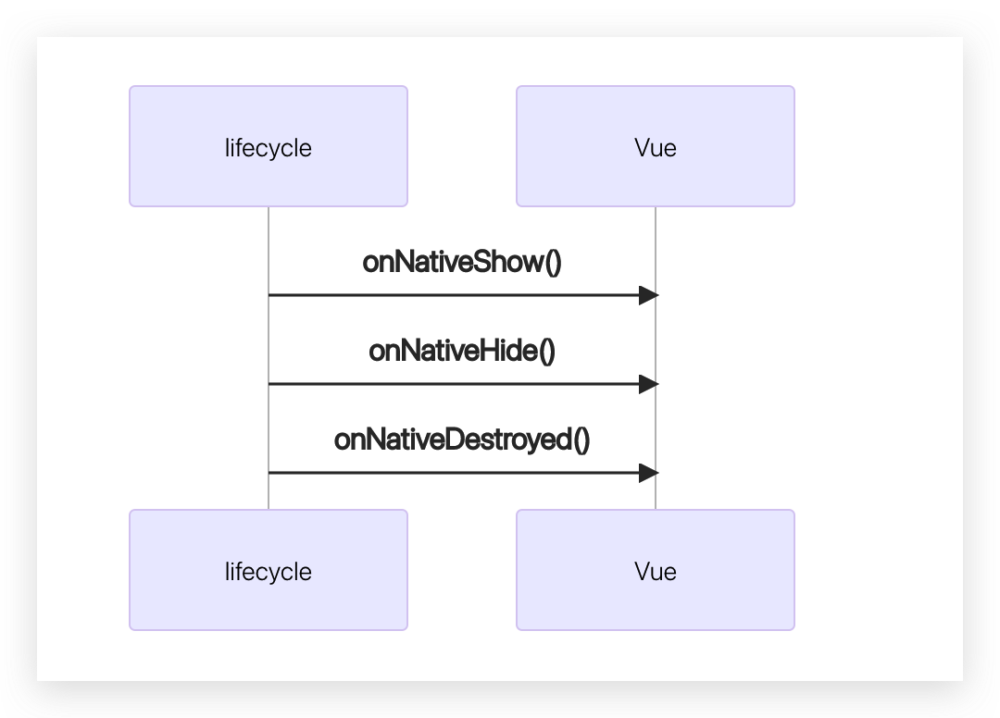

用 vue 开发，支持同时发h5，与原生。

有两种可能：
1. 一种是从 0 基于 vue 开发混合应用。 那你可以使用我们的 vue 标准工程模板。（不要使用 vue-cli  创建）
2. 普通 vue 项目已经存在了。需要迁移到原生。

## 使用前端模板工程
工程地址: https://github.com/zkty-team/vue-template

包含依赖

- Vant
- Vue
- @zkty-team/vuex
- @zkty-team/vue-router
- axios
- @zkty-team/x-engine-ui
- @zkty-team/x-engine-core
- @zkty-team/x-engine-lifecycle


## 集成到已有的 vue 工程
1. 安装 x-engine-core
1. 安装 x-engine-router
1. 安装 x-engine-lifecycle

### x-engine-core


- 连接h5和native的重要桥梁,一切操作都从该文件转发
- 所以`x-engine-core`务必安装

---

1. 安装方式

```bash
npm install @zkty-team/x-engine-core
```

2. 安装后挂载在Vue上使用, 在main.js中配置以下code

```bash
import engine from "@zkty-team/x-engine-core"
Vue.prototype.$engine = engine;
```

3. 配置成功后即可在全局通过`this.$engine.api`去触发原生相关模块

```javascript
// 示例
this.$engine.api(
	"com.zkty.jsi.device",
	"getNavigationHeight"
)
```

---

### x-engine-router

- 为了方便业务人员的开发,我们对原生VueRouter的跳转进行了拦截.
- 开发人员可以直接使用VueRouter的`push()`和`go()`来进行路由的相关操作。

---

1. 安装方式:

```bash
npm install @zkty-team/x-engine-router
```

2. 在vue项目中将以下内容放在router/index.js 即可

```javascript
// 示例
import Vue from "vue"
import VueRouter from "vue-router"
import XEngineRouter from " @zkty-team/x-engine-router"

// 参数1: 传入VueRouter实例
// 参数2: scheme
// scheme说明:
// 根据当前开发环境传入scheme:
//  1- omp 测试用
//    1.1- 打开线上地址的微应用 
//  2- http
//    2.1- 打开http的地址
//  3- https
//    3.1- 打开https的地址
//  4- microapp  
//    4.1- 打开原生应用内部的微应用
if (process.env.NODE_ENV == 'development') {
    XEngineRouter(VueRouter, 'omp');    
} else {
    XEngineRouter(VueRouter, 'microapp');
}
```

3. 配置成功后即可使用VueRouter的跳转方式进行跳转相关的操作

    [详细参考](./docs/modules/all/模块-direct.md)

---

### x-engine-lifecycle

- 由于现有引擎采用的是多webview的方案，

- 所以在在业务中,会出现以下情况:

    > - 从a页面点击item跳转到b页面修改状态后,返回a页面不会重新触发vue的生命周期
    > - 同时导致了a页面没有重新做网络刷新 显示的也不是最新的数据

- 安装`x-engine-lifecycle`模块,即可解决以上问题。

- `x-engine-lifecycle`生命周期图例



1. 安装方式:

```bash
npm install @zkty-team/x-engine-lifecycle
```

2. 在vue项目中将以下内容放在main.js 即可 ·
```javascript
   import lifeCycle from "@zkty-team/x-engine-lifecycle";
Vue.use(lifeCycle);
```

3. 使用方式 在每个页面中的methods中实现对应function即可
```javascript
methods: {
  onNativeShow() {},
  onNativeHide() {},
  onNativeDestroyed() {},
}
```

### vuex

- 由于现有引擎采用的是多webview的方案

- 所以在在业务中,会出现以下情况:

    > - 从a页面保存的数据 在b页面无法访问
    > - 从b页面保存的数据 在a页面无法访问

- 安装`@zkty-team/vuex`模块,即可解决以上问题。

- 安装该版本即可, 不用在安装官方的vuex。

    > - 支持state
    > - 支持commit
    > - 支持 action
		> - 支持 modules
    > - 支持 getters
    > - 支持vue dev tools

1. 安装方式:

```bash
npm install @zkty-team/vuex
```

2. 在vue项目中将以下内容放在main.js 即可 ·

```javascript
import store from "./store"
new Vue({
  store,
  render: (h) ==>h(App),
}).$mount("#app");
```

3. 在store的index中配置以下内容
```javascript
import Vue from 'vue'
import Vuex from '@zkty-team/vuex'
Vue.use(Vuex)
const store = new Vuex.Store({
    state: {
        count: 0,
    },
    mutations: {
        increament (state) {
            state.count++
        },
        decreament (state) {
            state.count--
        },
    },
    actions: {},
	  getters:{}
})
export default store
```

---

#### 什么情况下我应该使用 Vuex？

Vuex 可以帮助我们管理共享状态，并附带了更多的概念和框架。这需要对短期和长期效益进行权衡。

如果您不打算开发大型单页应用，使用 Vuex 可能是繁琐冗余的。确实是如此——如果您的应用够简单，您最好不要使用 Vuex。一个简单的 [store 模式 (opens new window)](https://cn.vuejs.org/v2/guide/state-management.html#简单状态管理起步使用)就足够您所需了。但是，如果您需要构建一个中大型单页应用，您很可能会考虑如何更好地在组件外部管理状态，Vuex 将会成为自然而然的选择。引用 Redux 的作者 Dan Abramov 的话说就是：

> Flux 架构就像眼镜：您自会知道什么时候需要它。

---

 [Vuex官方使用方式](https://vuex.vuejs.org/zh/guide/)

