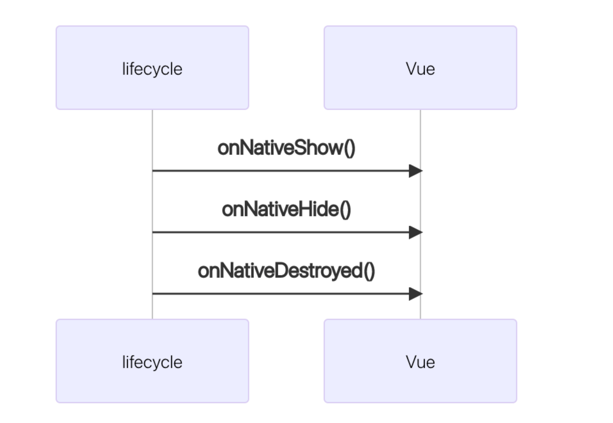

> 用 vue 开发，支持同时发h5，与原生。
>
> 有两种可能：
>
> 1. 一种是从 0 基于 vue 开发混合应用。 那你可以使用我们的 vue 标准工程模板。（不要使用 vue-cli  创建）
> 2. 普通 vue 项目已经存在了。需要迁移到原生。


## 1- 使用前端模板工程
工程地址: https://github.com/zkty-team/vue-template

包含依赖

- Vue
- Vant
- axios
- @zkty-team/vuex
- @zkty-team/vue-router
- @zkty-team/x-engine-ui
- @zkty-team/x-engine-core
- @zkty-team/x-engine-lifecycle


## 2- 集成到已有的 vue 工程

1. 安装 `@zkty-team/x-engine-core`
1. 安装 `@zkty-team/vuex`
1. 安装 `@zkty-team/vue-router`
1. 安装 `@zkty-team/x-engine-ui`
1. 安装 `@zkty-team/x-engine-lifecycle`


## 3- 模块介绍

### x-engine-core


- 连接h5和native的重要桥梁,一切操作都从该文件转发
- 所以`x-engine-core`务必安装

---

1. 安装方式

```bash
npm install @zkty-team/x-engine-core
```

2. 安装后挂载在Vue上使用, 在main.js中配置以下code

```bash
import xengine from "@zkty-team/x-engine-core"
Vue.use(xengine)
```

3. 配置成功后即可在全局通过`this.$engine.api`去触发原生相关模块

```javascript
// 同步调用
this.$engine.api("com.zkty.jsi.device",	"getTabbarHeight")

// 异步调用(异步的方法参考详细模块调用)
this.$engine.api("com.zkty.jsi.device",	"getTabbarHeight"), function (res) {
	 console.log("res :>> ", res)
})
```

4. 内置属性

```javascript
// 原生手机状态栏高度
this.$statusHeight

// 原生手机导航条高度
this.$navigatorHeight

// 原生手机屏幕整体高度
this.$screenHeight

// 原生手机底部tabbar高度
this.$tabbarHeight

// 原生手机相关信息
this.$deviceInfo.type              // iOS / android
this.$deviceInfo.systemVersion     // 14.4
this.$deviceInfo.language					 // en
this.$deviceInfo.UUID              // UUID number
```

---

### x-engine-lifecycle



1. 安装方式:

```bash 
npm install @zkty-team/x-engine-lifecycle
```

2. 在vue项目中将以下内容放在main.js 即可 ·

```javascript
import lifeCycle from "@zkty-team/x-engine-lifecycle";
Vue.use(lifeCycle);
```

3. 使用方式 在每个页面中的methods中实现对应function即可

```javascript
methods: {
  onNativeShow() {},
  onNativeHide() {},
  onNativeDestroyed() {},
}
```


---

### vue-router

- 为了方便业务人员的开发,我们对原生VueRouter的跳转进行了拦截.
- 开发人员可以直接使用VueRouter的`push()`和`go()`来进行路由的相关操作。
- 支持query传递参数    /  配合path使用
- 支持params传递参数 /  配合name使用

---

1. 安装方式:

```bash
npm install @zkty-team/vue-router
```

2. 在vue项目中将以下内容放在router/index.js 即可

```javascript
// 示例
import Vue from "vue"
import VueRouter from "@zkty-team/vue-router"
Vue.use(VueRouter)
```
**值得注意的是**
> 我们支持 'omp' 和 'microapp' 俩种protocol, 默认情况下如果你的页面打开是'http'或者'https' 那么protocol便是'omp', 如果你的页面是本地文件类似如'file'协议,便是 'microapp'<br>
```javascript
import Vue from "vue"
import VueRouter from "@zkty-team/vue-router"
Vue.use(VueRouter)
```
> 当然我们也支持手动传入protocol, 例如:
```javascript

import Vue from "vue"
import VueRouter from "@zkty-team/vue-router"
Vue.use(VueRouter, 'omp')
```
3. 配置成功后即可使用VueRouter的跳转方式进行跳转相关的操作 [详细参考](./docs/modules/all/模块-direct.md)
> tips:
>
> router配置中请设置为相同的path和name 如下

```javascript
const routes = [
  {
		path: "/testPage",
		name: "testPage",
	  component: () => import('../views/testPage.vue'),
  }
]
```

---

### vuex

1. 安装方式:

```bash
npm install @zkty-team/vuex
```

2. 在vue项目中将以下内容放在main.js 即可 ·

```javascript
import store from "./store"
new Vue({
  store,
  render: (h) ==>h(App),
}).$mount("#app");
```

3. 在store的index中配置以下内容
```javascript
import Vue from 'vue'
import Vuex from '@zkty-team/vuex'
Vue.use(Vuex)
const store = new Vuex.Store({
    state: {
        count: 0,
    },
    mutations: {
        increament (state) {
            state.count++
        },
        decreament (state) {
            state.count--
        },
    },
    actions: {},
	  getters:{}
})
export default store
```

---

#### 什么情况下我应该使用 Vuex？

Vuex 可以帮助我们管理共享状态，并附带了更多的概念和框架。这需要对短期和长期效益进行权衡。

如果您不打算开发大型单页应用，使用 Vuex 可能是繁琐冗余的。确实是如此——如果您的应用够简单，您最好不要使用 Vuex。一个简单的 [store 模式 (opens new window)](https://cn.vuejs.org/v2/guide/state-management.html#简单状态管理起步使用)就足够您所需了。但是，如果您需要构建一个中大型单页应用，您很可能会考虑如何更好地在组件外部管理状态，Vuex 将会成为自然而然的选择。引用 Redux 的作者 Dan Abramov 的话说就是：

> Flux 架构就像眼镜：您自会知道什么时候需要它。

 [Vuex官方使用方式](https://vuex.vuejs.org/zh/guide/)
