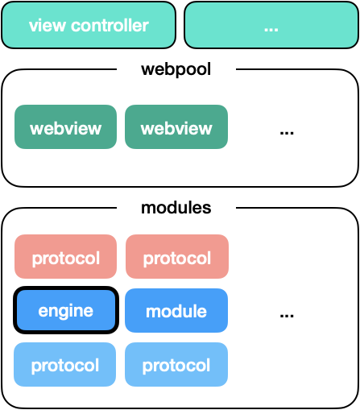

**基座扫描测试**
<div id='modulename' style='display:none'>engine</div>
</img>
<a id='qrlink' href="about:none">link of QR</a>

引擎是一个特别的组件,其他所有组件都需要依赖于它.  




引擎的工作：

- 组件的发现与编排, (注入)。

- 组件生命周期的管理与通知。

- webview 的编排.

  

>  要注意：组件不要依赖组件， 组件应该依赖于 protocol。这样，才可以使组件具有一定的独立性。


引擎中定义了可能会造成冲突的模块它们的 protocol。


如上例中， 当冲突发生时，如果依赖的库不可更改，只需在 module a 实现 protocol network，则可实现 afnetworking 3 到 4 的无缝迁移。


# JS


``` bash
npm install @zkty-team/com-zkty-module-container
```


## push


	
**参数说明**

| name                        | type      | optional | default   | comment  |
| --------------------------- | --------- | -------- | --------- |--------- |
| microAppId | string |  |  |  microAppid |
| routePath | string |  |  |  routerPath |
| direction | int |  |  |  direction 0:left->right    1: down->up |

    

# iOS


# android


