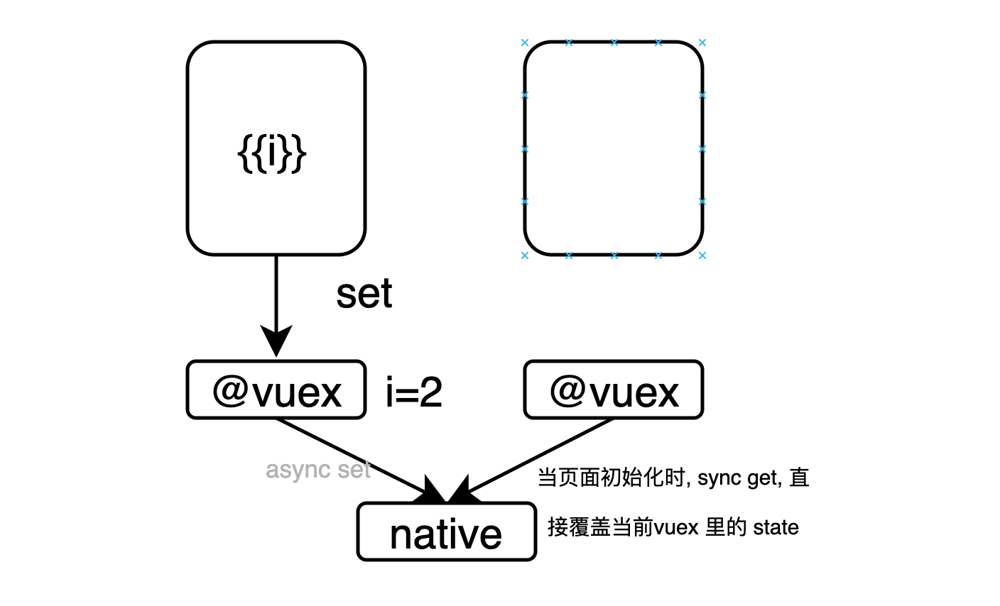

**基座扫描测试**
<div id='modulename' style='display:none'>vuex</div> </img>
<a id='qrlink' href="about:none">link of QR</a>

初版原理:




TODO:

1. 不要每次 set 时存值,而是通过生命周期 hook 去回调.
# api 


JSI Id: com.zkty.jsi.vuex

version: 0.1.13


## get
`sync`

**demo**
``` js

  xengine.api("com.zkty.jsi.vuex", "set",{
    key:'abc',
    val:'world'
  });

``` 

**无参数**

**返回值**
``` js
string
``` 


## set
`sync`

**demo**
``` js

  let val = xengine.api("com.zkty.jsi.vuex", "get",
    'abc',
  );
  console.log(val);

``` 

**参数说明**

| name                        | type      | optional | default   | comment  |
| --------------------------- | --------- | -------- | --------- |--------- |
| key | string | 必填 |  |  |
| val | string | 必填 |  |  |
**无返回值**


    
