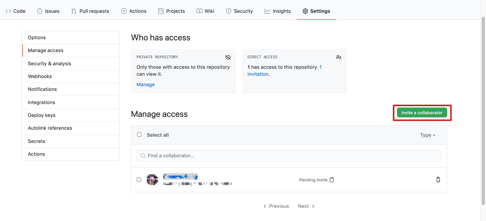
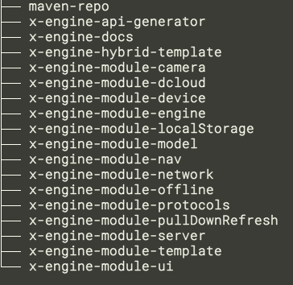

打包好的模块存在于各私有发布仓库, 如 npm , cocoapods , gradle。 方便在业务开发时可以任意拉取。  

以下教程指导用户在 github 上搭建私库。 


### npm

搭建 npm 的方式很多种， 举例说一下

#### 通过 github packages 搭建 npm

[参考](https://docs.github.com/en/packages/using-github-packages-with-your-projects-ecosystem/configuring-npm-for-use-with-github-packages#authenticating-with-a-personal-access-token)


#### 1） 搭一个私库

创建 github 私库

zk4/x-engine-npm.git


#### 2） 登陆 github pacakges

 ``` 
npm login --registry=https://npm.pkg.github.com
Username: USERNAME
Password: TOKEN
Email: PUBLIC-EMAIL-ADDRESS
 ```

> 拿 acess token https://github.com/settings/tokens


#### 3) 上传自己的包

建一文件夹叫 module_demo , 初始化

```
cd module_demo
// 创建一个带 scope 的 module
npm init @zk4/ui 
```


在 module_demo 里创建一个文件叫 `.npmrc`

```
registry=https://npm.pkg.github.com/zk4
```

 

修改package.json 

``` json
{
  "name": "@zk4/ui",
  "version": "1.0.0",
  "description": "",
  "main": "index.js",
  "repository" : {
    "type" : "git",
    "url": "ssh://git@github.com/zk4/x-engine-npm.git"
  },
  "scripts": {
    "test": "echo \"Error: no test specified\" && exit 1"
  },
  "author": "",
  "license": "ISC"
}
```


``` 
npm publish
```


#### 4) 别人使用你的包

比如有人的工程如下，

- xxxx
  - package.json

​	

在 pacakge.json 里加上

``` json
 "repository" : {
    "type" : "git",
    "url": "ssh://git@github.com/zk4/x-engine-npm.git"
  },
```


创建 .npmrc 

- xxxx
  - pacakge.json
  - .npmrc

```
registry=https://npm.pkg.github.com/zk4
```

> 注意 .npmrc 里的 registry 要与 package。json 里的 repository.url 属于同一个用户路径。


用户登陆 github pacakges， 

 ``` 
npm login --registry=https://npm.pkg.github.com
Username: USERNAME
Password: TOKEN  注意这里是 token 不是密码
Email: PUBLIC-EMAIL-ADDRESS
 ```

> 拿  acess token https://github.com/settings/tokens


将 github.com/zk4/x-engine-npm.git 私库的读权限给到用户



用户同意后， 即可安装私库里的包

```
npm install @zk4/ui
```


### cocoapods

安装 zkty 私库源

```
pod repo add x-engine-pods https://github.com/zkty-team/x-engine-pods.git
cd ~/.cocoapods/repos/x-engine-pods
pod repo lint .
```

[参考](https://guides.cocoapods.org/making/private-cocoapods.html)


### gradle

开发环境：

```
git clone https://github.com/zkty-team/maven-repo
```

>  注意，maven-repo 与模块存放的路径在同级。




模块引用时，直接引用到相对路径即可。 

pom.xml

```
<distributionManagement>
  <repository>
  <id>hengyunabc-mvn-repo</id>
  <url>file:../../../maven-repo/</url>
  </repository>
</distributionManagement>

```


gradle

生产环境：

搭建 NEXUS 服务器。

[参考](https://docs.github.com/en/packages/using-github-packages-with-your-projects-ecosystem/configuring-gradle-for-use-with-github-packages)

