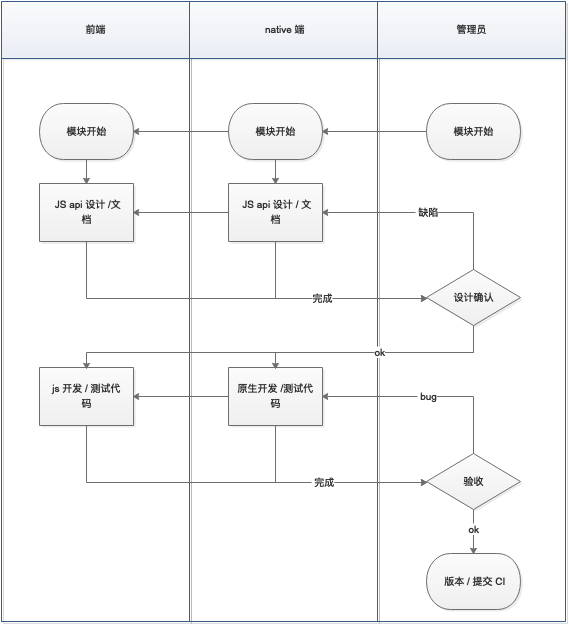
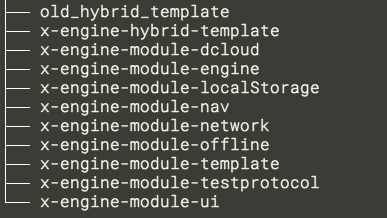
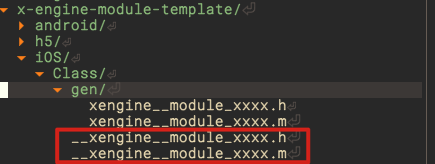
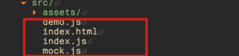

# 模块开发




 

## 流程

xegine 所有相关的模块与应用应放在统一文件夹下。

如 mdoules 下：




### 手动创建

我们试着创建一个 camera 模块。

*模块名禁止使用大写!　*

```bash
# 初始化： 安装 coge,(依赖 python3.8)
python3 -m pip install coge  

# 升级 coge
# python3 -m pip install coge -U

# 安装依赖
pip3 install pyyaml 

# 安装 x-cli 
npm install @zkty-team/x-cli -g 

cd modules/x-engine-module-template && coge -r

# 以模板镜像生成工程
coge x-engine-module-template xxxx:camera @:x-engine-module-camera -w

# 安装h5依赖包,并启动 h5　测试服务
cd  x-engine-module-camera && yarn && yarn dev

# iOS 开发
cd iOS && pod install　

# 将 url　地址指各 h5　测试服务
```


### x-cli 快速创建

但前提是　coge 安装成功了，并且　coge -r　已经执行过

```
x-cli　module init camera  x-engine-module-camera   　
```

见 [模块-工具.md](模块-工具.md) 


工程好后， 你的第一件事就是编写 model.ts ， 见  [模块-开发.md](模块-开发.md)  model.ts 帮助。

生成相应的接口。

#### iOS

 会生成在 gen 文件夹， 

你只需要继承生成的 m 文件，将类名前加两个`_` 就实现了自动发现并注册模块。




在 `__xengine__module_xxxx.m` 里右键生成未实现的接口文件，所以的待实现的方法，与参数都将自动生成。


#### java

java 类似。


#### h5

会自动生成测试文件。详见  [模块-工具.md](模块-工具.md) 



### 发布

必须 加入 npmjs 的开发组,  https://www.npmjs.com/settings/zkty-team/members , 向管理员申请.

```
npm publish --access public
```

