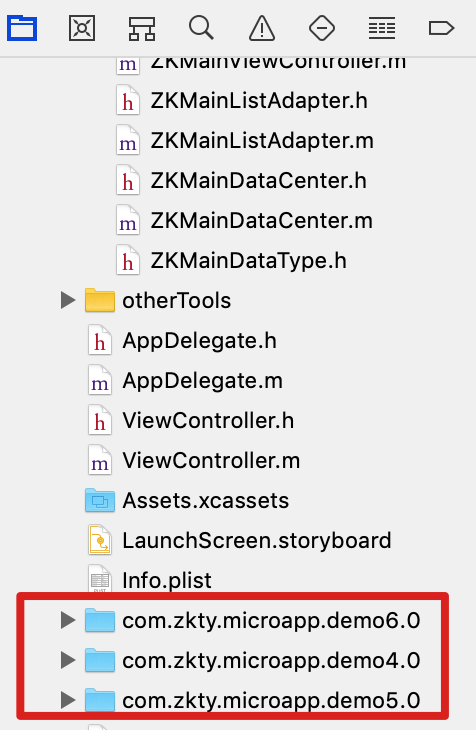

# microApp

### microapp demo 下载
https://github.com/zkty-team/x-engine-all/tree/main/microApps


### 开发流程

1. 使用 vue-cli 创建自己的项目.

2. 安装基座, 当前基座直接基于业务应用 app-c, 点击右上角铃铛, 扫描二维码, 即可预览. 二维码自己生成, 必须以 index.html 结尾.

   

### 预览基座

下载地址 [ios](https://www.pgyer.com/ZCfP) / [android](https://www.pgyer.com/LMaz)  


### 使用模块

有需要对接原生 api 的地方, 查找模块文档. 

文档地址:  [gitlab 镜像](http://8.129.6.138:8090/x-engine/x-engine-docs/tree/master/docs/modules/all) [公网地址](https://zk4.github.io/x-engine-docs-7006136fb67e0a01f60fab177fe9fddd/#/./docs/modules/all/%E6%A8%A1%E5%9D%97-engine)


比如: 安装 camera 模块. 

```
安装
yarn add @zkty-team/x-engine-module-camera

升级
yarn upgrade @zkty-team/x-engine-module-camera
```

如果 api 有问题, 请与引擎开发人员联系.


## 打包给引擎组

使用生产环境的包.

```
yarn build
```


确保入口为 index.html.

确保可以本地 file://... 打开,路由正确. 

如遇到跨域问题, 推荐两个方案

1. 使用 @zkty-team/x-engine-module-network 模块. 走原生网络
2. 要求服务端本身支持跨域请求


微应用包格式如下：

- {microAppId}.{version}.zip
  - index.html
  - \_\_microApp\_\_.json  
  - ..

>  如 com.zkty.module.propertyinfo.0.zip


\_\_microApp\_\_.json 

``` json
{
	"icon": "https://sdfsdf.sfsfsfsdf/icon.jpg",  //icon 位置 http(s):// ， 或相对于当前目录的位置
	"name": "物业管理",
  "microAppId":"com.zkty.microapp.property",
  "entry":"index.html",
	"version": 1
}
```


版本号从 0 号包开始, 0 号包会解压放在原生工程里做为原始包. 




## 热更新

###  全自动

提供了一个全自动的离线部署的模块，但需要服务端配合。参看[x-engine-module-offline](../modules/模块-offline.md)

同时, 原生工程里需要提供一个 xengine_config.json

xengine_config.json

``` json
{
  "appId": "com.zkty.linlijia",   
  "appSecret": "8b387ca3ebdd412e9c97ef81ed352ee7",  //随机 md5 值.
  "offlineServerUrl": "https://3rd-public-file.oss-cn-beijing.aliyuncs.com"  // 离线服务器地址
}
```

appId 是应用唯一id，用户指定，服务器判别是否有效。

appSecret 应该由服务器生成。

offlineServerUrl 为离线包更新地址。

> 在没有服务器逻辑，只有类似 ftp 的情况下， appId 与 appSecret 手动指定， 以备日后不时之需。


热更新模块会自动请求如下接口

https://3rd-public-file.oss-cn-beijing.aliyuncs.com/microApps.json

``` json
{
    "code": 0,
     
    "data": [
        {
            "microAppName": "物业公告1",
            "microAppId": "com.zkty.microapp.demo4",
            "microAppVersion": 2,
            "url": "http://192.168.8.120:8000/com.zkty.microapp.demo4.2.zip"
        }
    ]
}
```

热更新模块会对比工程或沙盒里的 microAppId 的版本号, 如果 microApps.json 里的更加新. 

则会去下载 url http://192.168.8.120:8000/com.zkty.microapp.demo4.2.zip

当再打开 com.zkty.microapp.demo4 时, 则已经是 version 为 2 的版本.


### 手动

更灵活的在微应用内部手动请求更新，

组合使用 [x-engine-module-tools](../modules/模块-tools.md) 与 [x-engine-module-network](../modules/模块-network.md) 模块即可。


