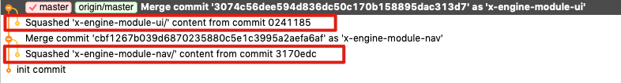
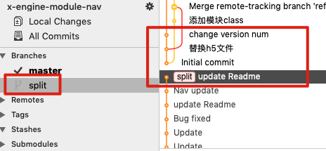
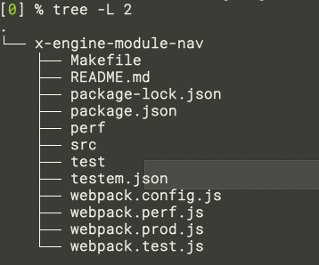

## commit 格式

**commit message格式**

```text
<type>(<scope>): <subject>
```

**type(必须)**

用于说明git commit的类别，只允许使用下面的标识。

 

**type(必须)**

用于说明git commit的类别，只允许使用下面的标识。

feat：新功能（feature）。

fix/to：修复bug，可以是QA发现的BUG，也可以是研发自己发现的BUG。

- fix：产生diff并自动修复此问题。适合于一次提交直接修复问题
- to：只产生diff不自动修复此问题。适合于多次提交。最终修复问题提交时使用fix

docs：文档（documentation）。

style：格式（不影响代码运行的变动）。

refactor：重构（即不是新增功能，也不是修改bug的代码变动）。

perf：优化相关，比如提升性能、体验。

test：增加测试。

chore：构建过程或辅助工具的变动。

revert：回滚到上一个版本。

merge：代码合并。

sync：同步主线或分支的Bug。

 

**scope(可选)**

scope用于说明 commit 影响的范围，比如数据层、控制层、视图层等等，视项目不同而不同。

例如在Angular，可以是location，browser，compile，compile，rootScope， ngHref，ngClick，ngView等。如果你的修改影响了不止一个scope，你可以使用*代替。


**subject(必须)**

subject是commit目的的简短描述，不超过50个字符。

建议使用中文（感觉中国人用中文描述问题能更清楚一些）。

- 结尾不加句号或其他标点符号。
- 根据以上规范git commit message将是如下的格式：

```text
fix(DAO):用户查询缺少username属性 
feat(Controller):用户查询接口开发
```

以上就是我们梳理的git commit规范，那么我们这样规范git commit到底有哪些好处呢？

- 便于程序员对提交历史进行追溯，了解发生了什么情况。
- 一旦约束了commit message，意味着我们将慎重的进行每一次提交，不能再一股脑的把各种各样的改动都放在一个git commit里面，这样一来整个代码改动的历史也将更

 


## subtree 

为了在一个工程里统一管理多个模块, 我们将使用 git subtree  做为辅助.

git subtree 并没有引入特殊的 git 组织结构. 




简单来说, 就是将其他仓库的文件直接 copy 到了本地工程. 相对 git submodule 来说, 暴力且简单.


```
SYNOPSIS
git subtree add   -P <prefix> <commit>
git subtree add   -P <prefix> <repository> <ref>
git subtree pull  -P <prefix> <repository> <ref>
git subtree push  -P <prefix> <repository> <ref>
git subtree merge -P <prefix> <commit>
git subtree split -P <prefix> [OPTIONS] [<commit>]
```

### 常规操作

```
git subtree <cmd> <repo-url> <branch>  --squash --prefix=<path-relative-to-root>
```

**git subtree add** (相当于 git clone)

``` bash
git subtree pull --prefix=x-engine-module-nav https://github.com/zkty-team/x-engine-module-nav  master --squash
```


**git subtree pull:**

``` bash
git subtree pull --prefix=x-engine-module-nav https://github.com/zkty-team/x-engine-module-nav  master --squash
```


**git subtree push**

``` bash
git subtree push --prefix=x-engine-module-nav https://github.com/zkty-team/x-engine-module-nav  master
```


###  拆分已有的仓库

https://lostechies.com/johnteague/2014/04/04/using-git-subtrees-to-split-a-repository/


```
# 将当前 h5 文件夹下的历史做成一个新的分支,叫做 split
# 在执行完后 h5文件夹并不会变
git subtree split --prefix=h5 -b split
```




```
# 只保留当前 h5 文件夹下的历史
git filter-branch --prune-empty --subdirectory-filter h5 master
```

执行完后, h5 文件夹下的东西到 root 级了. 其他的文件全删了. origin/master 也不再跟踪, 而只有本地的 master.

相当于你只在本地提交了历史.




## .gitignore


### Git ignore patterns

`.gitignore` uses [globbing patterns](http://linux.die.net/man/7/glob) to match against file names. You can construct your patterns using various symbols:

| Pattern                              | Example matches                                              | Explanation*                                                 |
| ------------------------------------ | ------------------------------------------------------------ | ------------------------------------------------------------ |
| `**/logs`                            | `logs/debug.log` `logs/monday/foo.bar` `build/logs/debug.log` | You can prepend a pattern with a double asterisk to match directories anywhere in the repository. |
| `**/logs/debug.log`                  | `logs/debug.log` `build/logs/debug.log` *but not* `logs/build/debug.log` | You can also use a double asterisk to match files based on their name and the name of their parent directory. |
| `*.log`                              | `debug.log` `foo.log` `.log` `logs/debug.log`                | An asterisk is a wildcard that matches zero or more characters. |
| `*.log` `!important.log`             | `debug.log` `trace.log` *but not* `important.log` `logs/important.log` | Prepending an exclamation mark to a pattern negates it. If a file matches a pattern, but *also* matches a negating pattern defined later in the file, it will not be ignored. |
| `*.log` `!important/*.log` `trace.*` | `debug.log` `important/trace.log` *but not* `important/debug.log` | Patterns defined after a negating pattern will re-ignore any previously negated files. |
| `/debug.log`                         | `debug.log` *but not* `logs/debug.log`                       | Prepending a slash matches files only in the repository root. |
| `debug.log`                          | `debug.log` `logs/debug.log`                                 | By default, patterns match files in any directory            |
| `debug?.log`                         | `debug0.log` `debugg.log` *but not* `debug10.log`            | A question mark matches exactly one character.               |
| `debug[0-9].log`                     | `debug0.log` `debug1.log` *but not* `debug10.log`            | Square brackets can also be used to match a single character from a specified range. |
| `debug[01].log`                      | `debug0.log` `debug1.log` *but not* `debug2.log` `debug01.log` | Square brackets match a single character form the specified set. |
| `debug[!01].log`                     | `debug2.log` *but not* `debug0.log` `debug1.log` `debug01.log` | An exclamation mark can be used to match any character except one from the specified set. |
| `debug[a-z].log`                     | `debuga.log` `debugb.log` *but not* `debug1.log`             | Ranges can be numeric or alphabetic.                         |
| `logs`                               | `logs` `logs/debug.log` `logs/latest/foo.bar` `build/logs` `build/logs/debug.log` | If you don't append a slash, the pattern will match both files and the contents of directories with that name. In the example matches on the left, both directories and files named *logs* are ignored |
| logs/                                | `logs/debug.log` `logs/latest/foo.bar` `build/logs/foo.bar` `build/logs/latest/debug.log` | Appending a slash indicates the pattern is a directory. The entire contents of any directory in the repository matching that name – including all of its files and subdirectories – will be ignored |
| `logs/` `!logs/important.log`        | `logs/debug.log` `logs/important.log`                        | Wait a minute! Shouldn't `logs/important.log` be negated in the example on the left  Nope! Due to a performance-related quirk in Git, you *can not* negate a file that is ignored due to a pattern matching a directory |
| `logs/**/debug.log`                  | `logs/debug.log` `logs/monday/debug.log` `logs/monday/pm/debug.log` | A double asterisk matches zero or more directories.          |
| `logs/*day/debug.log`                | `logs/monday/debug.log` `logs/tuesday/debug.log` *but not* `logs/latest/debug.log` | Wildcards can be used in directory names as well.            |
| `logs/debug.log`                     | `logs/debug.log` *but not* `debug.log` `build/logs/debug.log` | Patterns specifying a file in a particular directory are relative to the repository root. (You can prepend a slash if you like, but it doesn't do anything special.) |

 

In addition to these characters, you can use # to include comments in your `.gitignore` file:

```
# ignore all logs
*.log
```

You can use \ to escape `.gitignore` pattern characters if you have files or directories containing them:

```
# ignore the file literally named foo[01].txt
foo\[01\].txt
```

### Shared .gitignore files in your repository

Git ignore rules are usually defined in a `.gitignore` file at the root of your repository. However, you can choose to define multiple `.gitignore` files in different directories in your repository. Each pattern in a particular `.gitignore` file is tested relative to the directory containing that file. However the convention, and simplest approach, is to define a single `.gitignore` file in the root. As your `.gitignore` file is checked in, it is versioned like any other file in your repository and shared with your teammates when you push. Typically you should only include patterns in `.gitignore` that will benefit other users of the repository.

### Personal Git ignore rules

You can also define personal ignore patterns for a particular repository in a special file at `.git/info/exclude`. These are not versioned, and not distributed with your repository, so it's an appropriate place to include patterns that will likely only benefit you. For example if you have a custom logging setup, or special development tools that produce files in your repository's working directory, you could consider adding them to `.git/info/exclude` to prevent them from being accidentally committed to your repository.

## Global Git ignore rules

In addition, you can define global Git ignore patterns for all repositories on your local system by setting the Git `core.excludesFile` property. You'll have to create this file yourself. If you're unsure where to put your global `.gitignore` file, your home directory isn't a bad choice (and makes it easy to find later). Once you've created the file, you'll need to configure its location with `git config`:

```
$ touch ~/.gitignore
$ git config --global core.excludesFile ~/.gitignore
```

You should be careful what patterns you choose to globally ignore, as different file types are relevant for different projects. Special operating system files (e.g. `.DS_Store` and `thumbs.db`) or temporary files created by some developer tools are typical candidates for ignoring globally.

## Ignoring a previously committed file

If you want to ignore a file that you've committed in the past, you'll need to delete the file from your repository and then add a `.gitignore` rule for it. Using the `--cached` option with `git rm` means that the file will be deleted from your repository, but will remain in your working directory as an ignored file.

```
$ echo debug.log >> .gitignore
$ git rm --cached debug.log
rm 'debug.log'
$ git commit -m "Start ignoring debug.log"
```

You can omit the `--cached` option if you want to delete the file from both the repository and your local file system.

### Committing an ignored file

It is possible to force an ignored file to be committed to the repository using the `-f` (or `--force`) option with `git add`:

```
$ cat .gitignore
*.log
$ git add -f debug.log
$ git commit -m "Force adding debug.log"
```

You might consider doing this if you have a general pattern (like `*.log`) defined, but you want to commit a specific file. However a better solution is to define an exception to the general rule:

```
$ echo !debug.log >> .gitignore
$ cat .gitignore
*.log
!debug.log
$ git add debug.log
$ git commit -m "Adding debug.log"
```

This approach is more obvious, and less confusing, for your teammates.

 