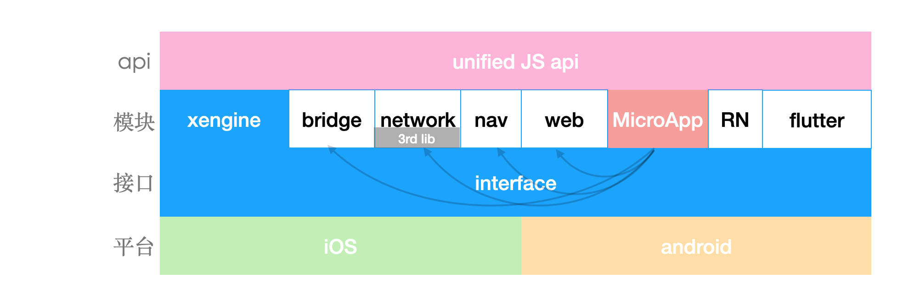
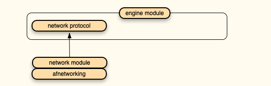

x-engine 理论上只负责管理模块， 但因为当前业务需求，我们提供了一些具体功能。比如支持类似小程序的 MicroApp。

## 架构图




## 模块化

模块开发可见： [模块-开发.md](../../modules/模块-开发.md) 

引擎本身就有有可能会依赖某些模块，如 network， 被依赖的模块会以接口的形式被引用，用户如果需要自定义自己的 network 模块，则必须实现相应的接口，在 iOS 里表现为 protocol 接口，在 android 里则是 interface 接口， 接口定义在引擎里。

这样做的原因是： 

当引擎所依赖的模块与用户模块相冲突时， 用户可以替换引擎模块，又不影响引擎的功能。




###  自动注册模块
生写代码，直接由模板管理了。

### 依赖注入

依赖注入是模块管理最强大的功能。 分三个等级。

自我实例化。

依赖实例化注入。

循环依赖实例化注入。 


在 xengine 中， 依赖实例化注入需要在模块里写点代码，暂时不考虑模块的循环依赖。非常够用。

```
// 模块自我实例化完成回调
- (void) onAllModulesInited;
```


见 [模块-engine.md](../../modules/all/模块-engine.md) 

 

