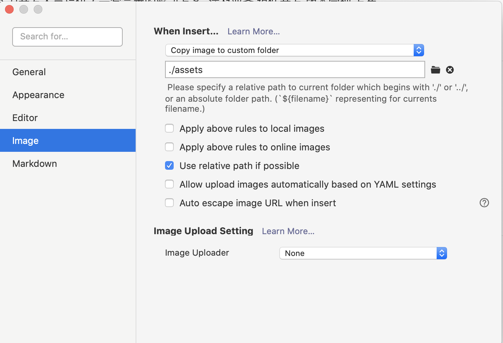
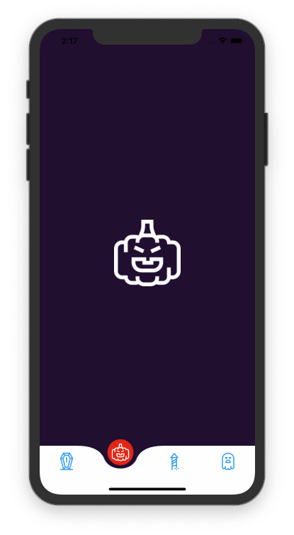
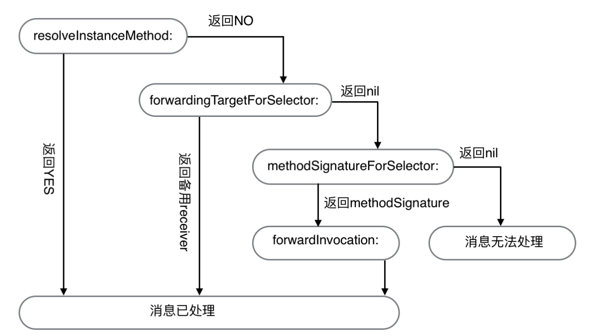

# 资源
-[SEIN.JS - 渐进式Web3D解决方案](https://github.com/hiloteam/Sein.js)


## typora 配置



## worktile
https://zktyfe.worktile.com/tasks/my

## vue to 小程序
https://max-team.github.io/Mars/


## 3d face 
https://3d-book-css.netlify.app/

## frame motion
https://www.framer.com/motion/


## agentwebveiw  for android 
对比一下 x5 
https://github.com/Justson/AgentWeb

## draw custom tabbar 
https://medium.com/@acerodstin/how-to-create-customised-tab-bar-for-ios-devices-7c89efaeac95

/Users/zk/git/hybrid-app/VBRRollingPit



/Users/zk/git/hybrid-app/AMTabView/AMTabView


保护 ios 不闪退 
https://github.com/jezzmemo/JJException


## java 规范
https://hollischuang.github.io/toBeTopJavaer/#/basics/java-basic/value-of-vs-to-string


## 工程组织方式

参考  reactie native


## OS 调用

当 objc_msgSend 找不到方法时，会走下面流程。




# Notification Once

前段时间整理项目中的`AppDelegate`，发现很多写在`- application:didFinishLaunchingWithOptions:`中的代码都只是为了在程序启动时获得一次调用机会，多为某些模块的初始化工作，如：

```
- (BOOL)application:(UIApplication *)application
didFinishLaunchingWithOptions:(NSDictionary *)launchOptions {
    // ...
    [FooModule setup];
    [[BarModule sharedInstance] setup];
    // ...
    return YES;
}
```

其实这些代码完全可以利用`Notification`的方式在自己的模块内部搞定，分享一个巧妙的方法：

```
/// FooModule.m
+ (void)load
{
    __block id observer =
    [[NSNotificationCenter defaultCenter]
     addObserverForName:UIApplicationDidFinishLaunchingNotification
     object:nil
     queue:nil
     usingBlock:^(NSNotification *note) {
         [self setup]; // Do whatever you want
         [[NSNotificationCenter defaultCenter] removeObserver:observer];
     }];
}
```

解释：

- `+ load`方法在足够早的时间点被调用
- block 版本的通知注册会产生一个`__NSObserver *`对象用来给外部 remove 观察者
- block 对 observer 对象的捕获早于函数的返回，所以若不加`__block`，会捕获到 nil
- 在 block 执行结束时移除 observer，无需其他清理工作
- 这样，在模块内部就完成了在程序启动点代码的挂载

值得注意的是，通知是在`- application:didFinishLaunchingWithOptions:`调用完成后才发送的。
顺便提下给 AppDelegate 瘦身的建议：AppDelegate 作为程序级状态变化的 delegate，应该只做**路由**和**分发**的作用，具体逻辑实现代码还是应该在分别的模块中，这个文件应该保持整洁，除了`<UIApplicationDelegate>`的方法外不应该出现其他方法。