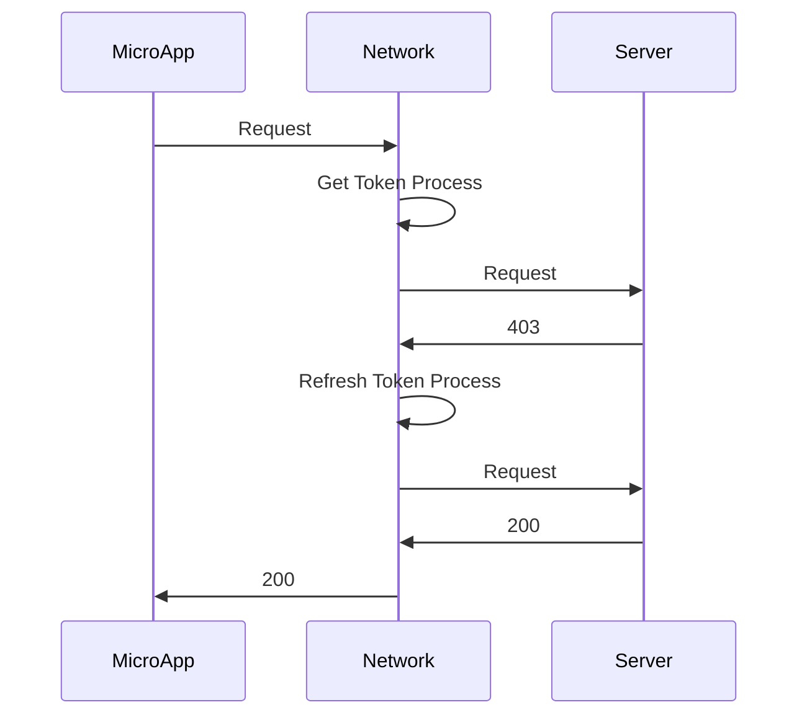
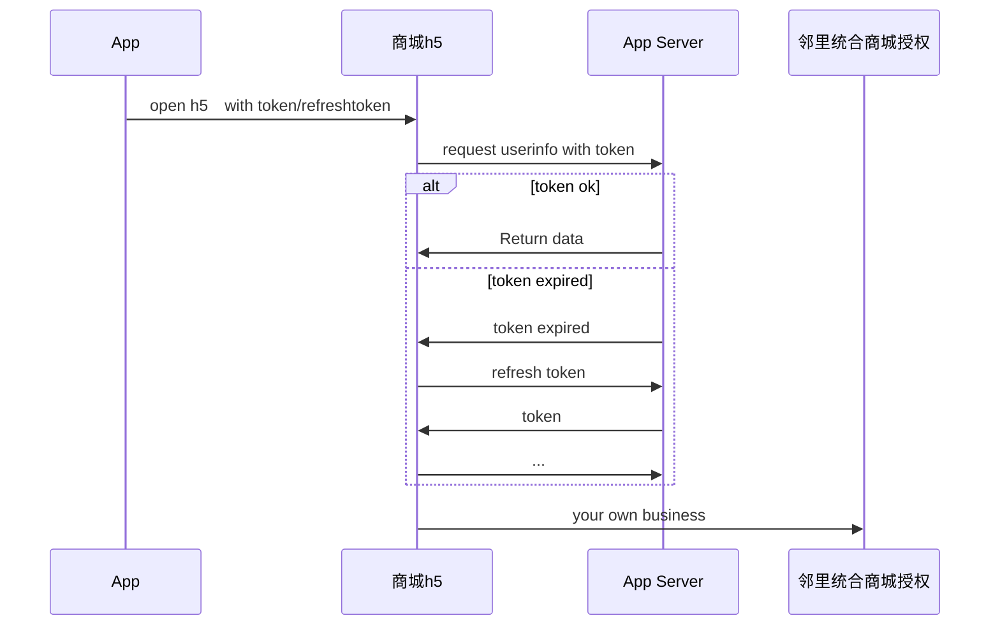
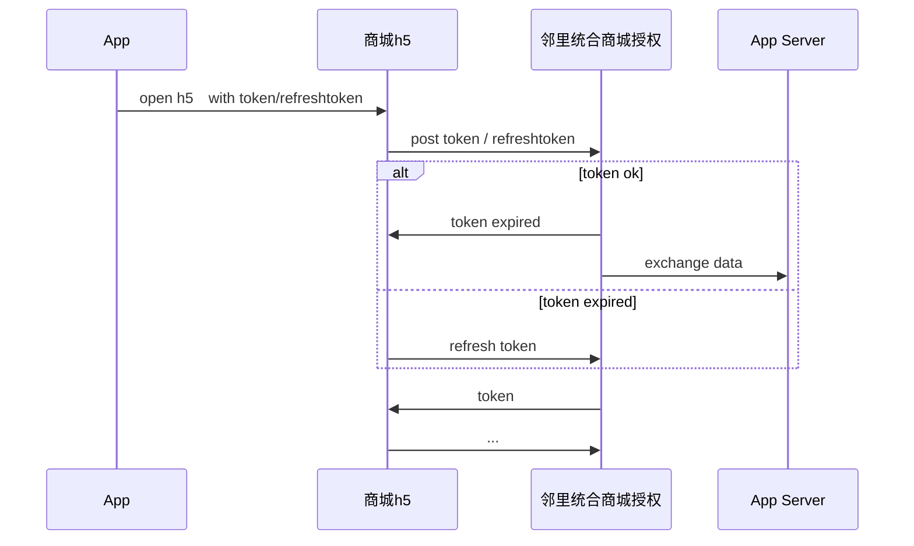
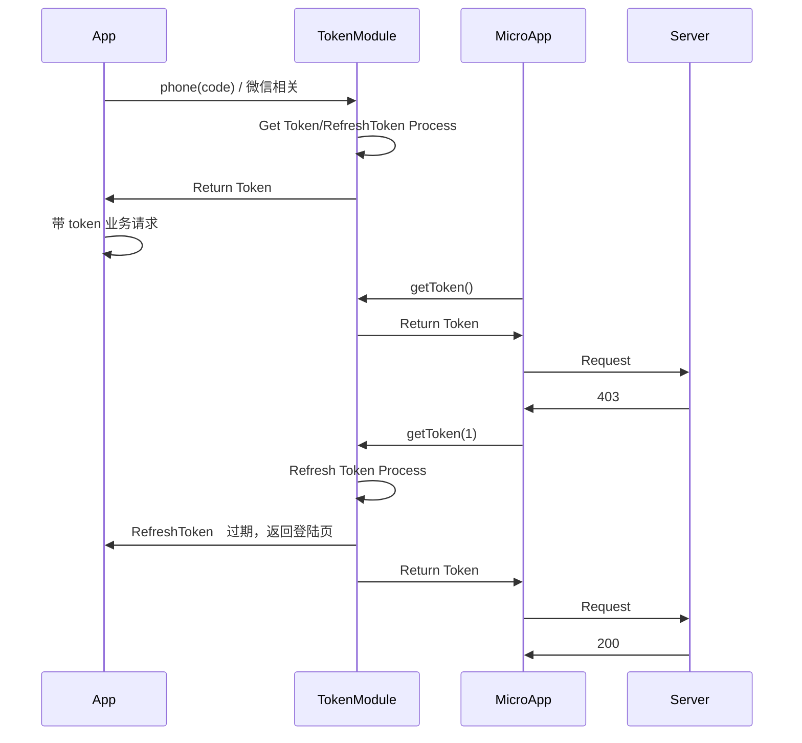
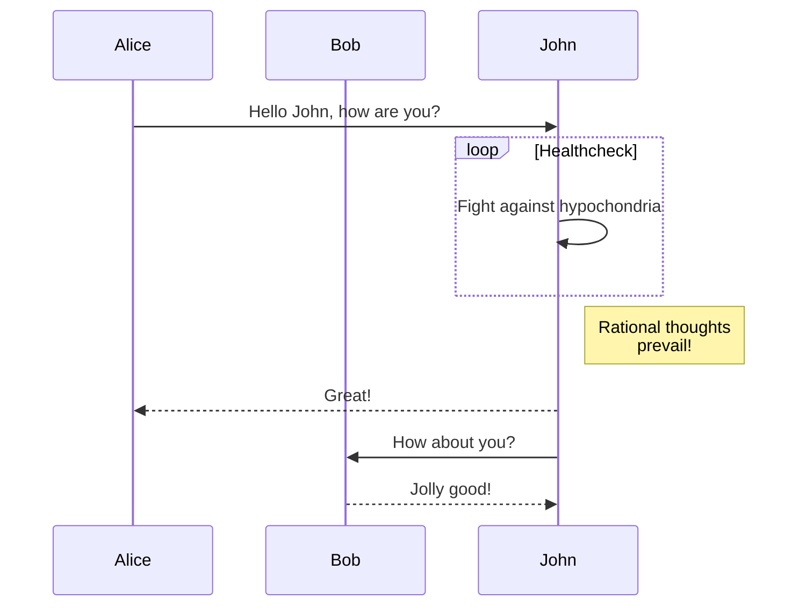
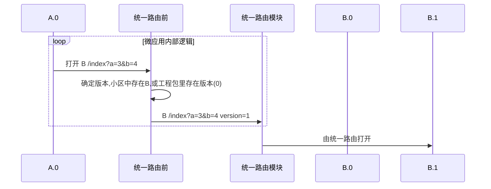
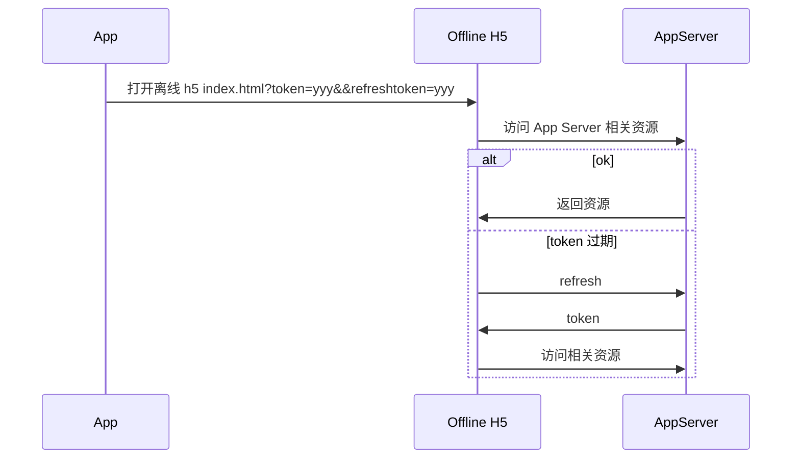

画图 https://mermaid-js.github.io/mermaid/#/

##　当前问题

业务将会污染网络模块，两种隔离业务的方案，

1.　通过 js　传入业务登陆逻辑。
2.　将业务逻辑单独模块化。（当前解决方案）



## 方案 1：h5 方案








## 方案 2：将业务逻辑单独模块化 

x-engine-module-timestoken







## 微应用互调方案

理想状态



常规来讲, 微应用之间的调用是不需要传递版本号的, 因为直接就找最高版本. 

但现实情况是, 微应用跟小区绑定了版本号.


如果打开 B.0 是从微应用 A.0 里直接发起, 则 [统一路由前] 的逻辑应该由 微应用 A.0 自己完成. **因为 [统一路由模块] 不带业务**.

A.0 得知道小区对应的版本.

解决方案:

将小区 id 写入 localstorage. 


## 微应用开启流程

``` mermaid
sequenceDiagram
		participant App
		participant 统一路由模块
		participant 消息中心模块
		participant (引擎)微应用模块
		participant 微应用A
		participant 微应用B
		
		App ->> (引擎)微应用模块: 传递需要下载的微应用任务
		(引擎)微应用模块->>(引擎)微应用模块: 异步下载
		App ->> 统一路由模块: 打开微应用 A 	参数(type,uri,path,version,args)
		统一路由模块->>(引擎)微应用模块: 打开微应用 A	参数(type,uri,path,version,args)
		(引擎)微应用模块->>(引擎)微应用模块: 查找微应用 A
		alt 找到
			(引擎)微应用模块->>微应用A:  打开 
		else 未找到(无相关 version)
			(引擎)微应用模块->>微应用A:  打开旧版 
		else 正在下载
			(引擎)微应用模块->>消息中心模块: 正在下载
		else 找不到microappid
			(引擎)微应用模块->>消息中心模块:  找不到
		end
		微应用A->>统一路由模块:  打开微应用B 参数(type,uri,path,version,args)
		

```


## 第三方离线h5接入



