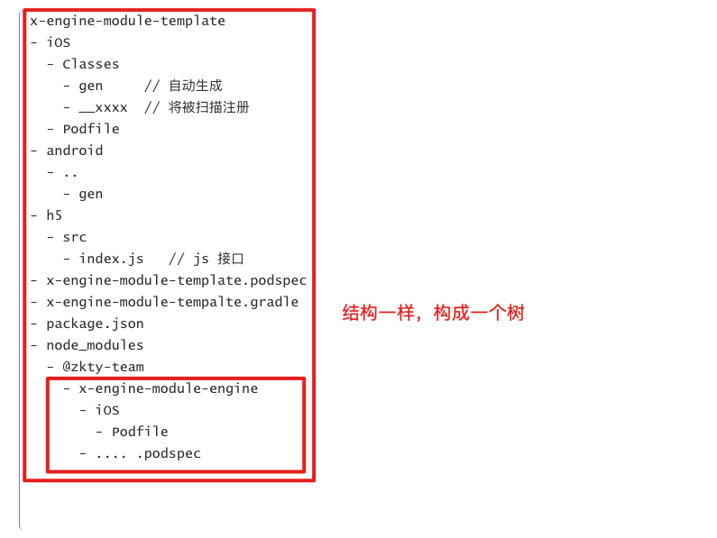

## 需求

- 只使用 npm 管理三端代码
- npm install 模块时，能自动利用 pod 或 gradle 引入相关模块
- 能够将 android 或 ios 特殊文件安装或权限配置上
  - iOS
    - 修改 Pofile
    - 修改 plist
    - 修改 工程
  - android 
    - 修改 权限
    - 修改 gradle 配置

总之， 希望能一行命令行解决。


>  在 [React-Native ]( https://reactnative.cn/docs/native-modules-android) 里， 自定义模块的安装过程是无比痛苦的。你要非常的小心翼翼的根据作者的文档安装。作者得写对，你得用对。


## 原理

npm publish 在上传时，默认只会当前传所有的文件。

但利用 package.json 里的 files，可以指定要上传的文件

但要注意：如果你指定了 files ，则一定会按照 files 的规则， 如果你files 里什么都没有，那除了 package.json 会上传，其他文件都不会上传。

指定只上传 bin lib 目录。

```
"files": [ "bin", "lib" ]
```


模块将统一上传到 npm package. 也就是用 js 的模块管理，管理三端的模块。

模块组织结构：

``` 
x-engine-module-template 
- iOS
  - Classes
    - gen     // 自动生成
    - __xxxx  // 将被扫描注册
  - Podfile   
- android
  - ..
    - gen
- h5
  - src
    - index.js   // js 接口
- x-engine-module-template.podspec
- x-engine-module-tempalte.gradle
- package.json   
- node_modules
	- @zkty-team
		- x-engine-module-engine
			- iOS
				- Podfile
			- .... .podspec
		
```




要注意，podspec 里的 dependency 的写法。比如你依赖了 x-engine-module-engine

```
s.dependency "x-engine-module-engine"
```

但很显然，我们并没有上传到远程库， 那在你引用工程的 Podfile 里，你必须显示的指定 x-engine-module-engine 的位置

```
pod 'x-engine-module-engine', :path =>'../../x-engine-module-engine'
```


