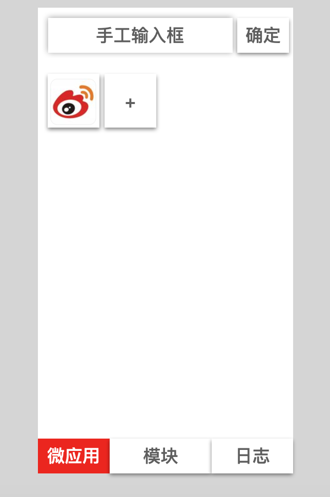
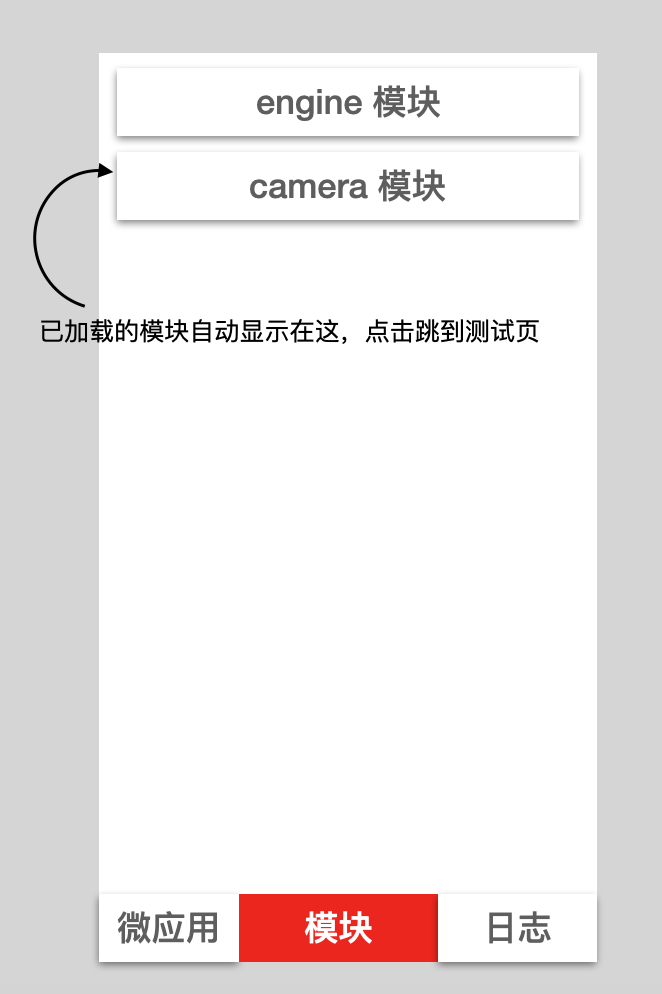
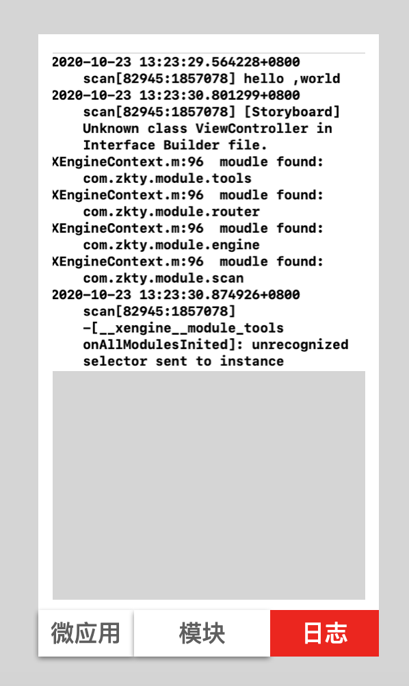

## 目标

供开发人员快速调试

用 coge 基于模块创建文件夹： x-engine-app-motherboard


## 功能设计

### 微应用

#### 扫描

扫描二维码打开微应用，同时将识别到的地址放入微应用手工输入框。

显示加载进度条，

从微应用里返回时，将在扫描二维码的入口处生成一个指向微应用的按钮。长按可删除。

读取链接下的 \_\_microApp\_\_.json, 获得相关信息。

```json
{
	"icon": "https://sdfsdf.sfsfsfsdf/icon.jpg",  //icon 位置 http(s):// ， 或相对于当前目录的位置
	"name": "物业管理",
  "microAppId":"com.zkty.microapp.property",
  "entry":"index.html",
	"version": 1
}
```


扫描二维码的按钮向可移动方向移动。 

#### 手工输入

可手动输入微应用地址，在微应用列表处增加一个。点输入后， 地址不清空。

### 模块列表

显示当前已加载模块，点击可打开在线的测试微应用页面。

### 原生日志输出


#### 集成 DoraemonKit


## UI 

力求满足功能，美学自定。 

### 微应用



### 模块



## 日志

