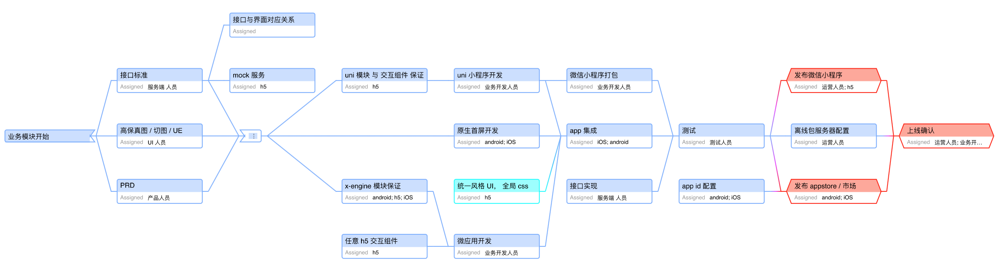
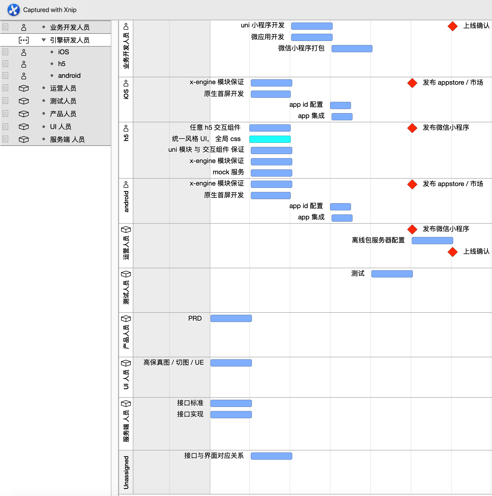
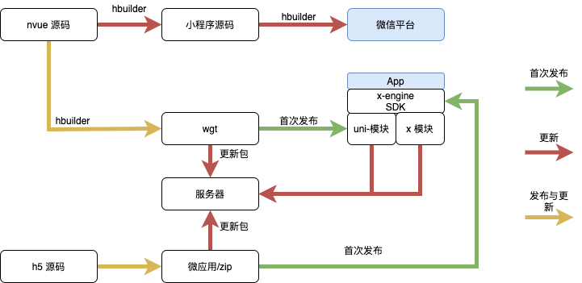

## 目标

**App-C** 与 **App-B** ，以及相关**小程序**

于 10 月底上线？

## 待确认事项

1. 微信小程序与相关应用的区别
2. app-c 与 app-b 内明确的应用功能。


## 开发流程



 

## 文档受众

具体受众如下图所示



## 输入资源

### 对接人与相关资料

以下前缀均为 app-c ，app-b， 微信小程序

- PRD （12 号）
  - 具体对接人?
  - 资源地址?
- 高保真图/切图 
  - 具体对接人?
  - 资源地址?


- 接口 Mock 中间层

  - 具体对接人?
  - 资源地址 ？
- 接口与界面对应表

  - 具体对接人
- 接口实现联调时间点      

  - 具体对接人?
  - 资源地址 http://dev.linli580.com:10000/doc.html#/home
- 测试人员      

  - 具体对接人  ？
  - iOS uuid 号
  - 微信 id 号，需要邀请为体验人员
- 运营人员      

  - 具体对接人 ？
- 发布小程序的微信开发者账号


>已知资源:
>
>web 端 原型： https://dp2qak.axshare.com/#id=3kyi7n&p=_wb-idx-01-001_____&g=1
>app 端 原型： https://r3hp3w.axshare.com/#id=v3gjhm&p=_ac-idx-01-009____&g=1
>app 端 PRD ： https://www.yuque.com/sinotaiyo/times/pazf38 (加入组才能看到)


### 跨端协作机制

**信息流协作 ？ **

涉及到信息流版本的统一，如文档的交接，修改，确认。

**流程管理 **

涉及到项目节点管理。如测试包的分发，测试反馈等。

 

### 质量标准

#### 开发标准

移动平台兼容性 ？

android ?

iOS ?

#### 线上标准

bug 率 ？


## 输出资源

### app-b / app-c

#### 测试包

每完成一个业务模块，会提供一个测试的包。

统一为蒲公英的测试下载地址。（iOS  测试人员需要提供 UUID）

#### 上线

- iOS 应用： 开发人员提交到 app store，由运营人员上线
- android 应用： 开发人员将生产 apk 给到运营人员，由运营人员上线

### 小程序

#### 测试

测试人员提供，微信 id 号，开发人员在完成业务模块后，将体验测试版给到测试人员（二维码）。

#### 上线

开发人员提交小程序到微信平台，由运营人员上线


##  协作资源

### 微应用

####  id 规则

{公司域名倒写}.microapp.{业务名}

比如 com.zkty.microapp.opendoor

#### 离线包

zip 需要带上版本号， 如 com.zkty.microapp.opendoor.0.zip

#### 离线服务器

见 [uni 小程序离线包配置规则](#uni 小程序离线包配置规则), 逻辑一样，只是函数名不同。服务端只需保证统一接口。

#### 灰度更新

在 header 里带上哪些参数？


### uni 小程序

#### id 规则

由 hbuilder  生成。[参考](https://ask.dcloud.net.cn/article/35907)

#### 离线包

wgt 格式，由 hbuilder 输出

#### 路由规则

见 [统一路由模块](#统一路由模块)

#### 离线包配置规则

#### 服务端接口

约定检测升级的接口，比如：http://www.example.com/update/

#### 传入参数

| 参数名  | 类型   | 默认值 | 说明                                                         |
| :------ | :----- | :----- | :----------------------------------------------------------- |
| name    | String | ''     | 客户端读取到的应用名称，定义这个参数可以方便多个应用复用接口。 |
| version | String | ''     | 客户端读取到的版本号信息                                     |


#### 返回参数

| 参数名     | 类型    | 默认值 | 说明                                                       |
| :--------- | :------ | :----- | :--------------------------------------------------------- |
| update     | Boolean | false  | 是否有更新                                                 |
| packageUrl | String  | ''     | wgt/zip 包的下载地址，用于 wgt/zip 方式更新。              |
| appUrl     | String  | ''     | apk/ipa 包的下载地址或 AppStore 地址，用于整包升级的方式。 |

详情参考 [uni-app 官方文档](https://ask.dcloud.net.cn/article/35667)


## 技术方案

### 泛架构

- 端
  - 业务入口 a
  - 业务入口 b
  - 业务入口 c


**名词定义**：   

端： Android  /  iOS  / 微信 / 支付宝 / 头条 ..      

业务入口：业务模块入口，功能实现可能是 uniapp，纯网页链接，微应用，微信小程序的某页 ，由[统一路由模块](#统一路由模块) 统一路由。

 





### 开发环境搭建

#### uni 小程序/ 微信小程序

参考 https://www.dcloud.io/hbuilderx.html

#### 微应用

注意：当前开发环境工具仅支持 iOS

参考 [微应用?id=环境搭建](./docs/product/微应用?id=环境搭建)

### 推送模块

TODO 走模块开发规范

### 统一路由模块

以模块的形式存在，统一所有的跳转


#### 规则

- 跳 h5
  - https://..
- 跳微应用
  - appid + 路径 + 参数
- 跳 uniapp
  - appid + 路径 + 参数
- 跳 [微信小程序](https://developers.weixin.qq.com/doc/oplatform/Mobile_App/Launching_a_Mini_Program/iOS_Development_example.html)
  - userName + 路径 + 参数
- 跳原生界面
  - iOS
    - controller 名 + 参数
  - android
    - ?


 后台需要传递

````
{
  type: string (native | h5 | microapp | uni | wx ),  // 类型
  uri:  string (url | appid | wx_username | 'XViewController,XActivity'), // 资源名
  path: string                         // 路径与简单参数 /abc  /abc?a=1?b=dfd
}
````

> 注： 如果 uni app 需要支持统一路由，则需要将 uni 请求代理到统一路由模块。

[跳微信小程序需知](https://developers.weixin.qq.com/doc/oplatform/Mobile_App/Launching_a_Mini_Program/Launching_a_Mini_Program.html)

**跳转规则**

1. 对于已通过认证的开放平台账号，其移动应用可以跳转至任何合法的小程序，且不限制跳转的小程序数量。
2. 对于未通过认证的开放平台账号，其移动应用仅可以跳转至同一开放平台账号下小程序。

>  注意：若移动应用未上架，则最多只能跳转小程序100次/天，用于满足调试需求。


#### 方案

1. 有开放平台账号
2. 集成 opensdk 到原生应用
3. opensdk 绑定开放平台账号


### 兼容 ios 14

TODO 待调研

> 上图蓝色的任务条，无先后顺序之分。 先后顺序见 [业务模块开发流程]

  

## 功能拆解与排期

*TODO 需要将 [输入资源](#输入资源) 先确定*

### 统一的 css

由于功能入口涉及到 h5, 微应用，uniapp 的混编。

微应用与 h5,以及 uniapp 在样式上应该有一套统一的 css，来表达一些公共 UI，如按钮，弹窗。


### 各功能实现方案

#### app-c

- splash
- 登陆
- tab 四页
  - 首页
    - 各种分区
    - 功能入口 * n
  - 服务
  - 开门 （原生）
  - 商城
  - 我的


#### app-b

#### 小程序


