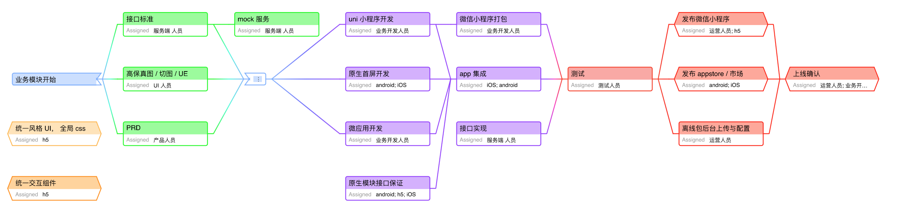
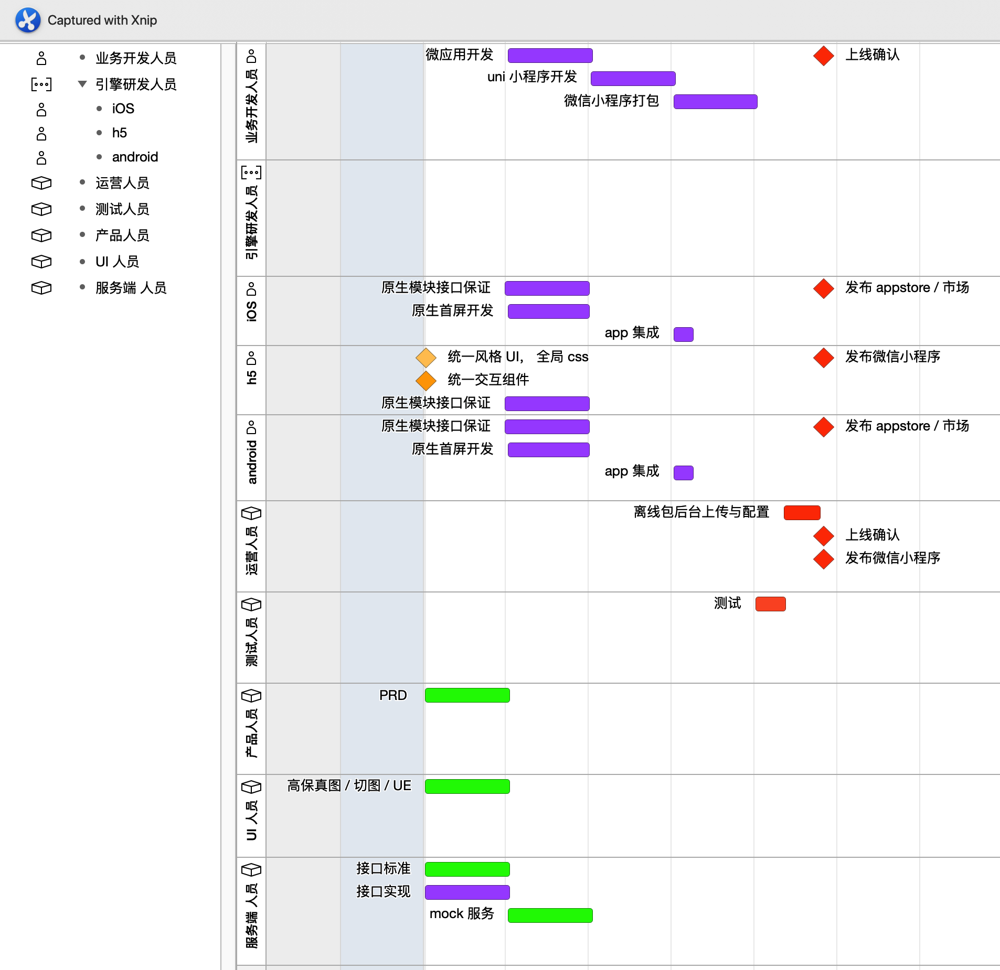
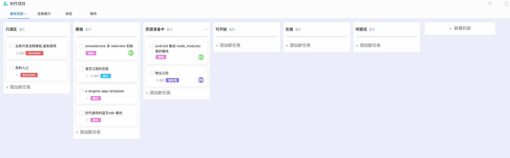
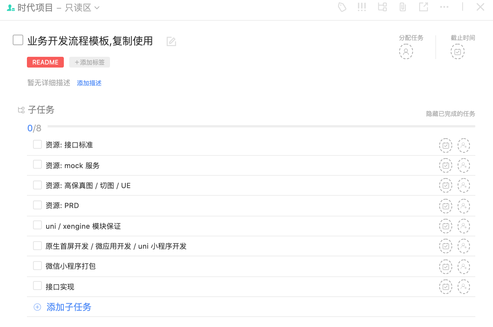
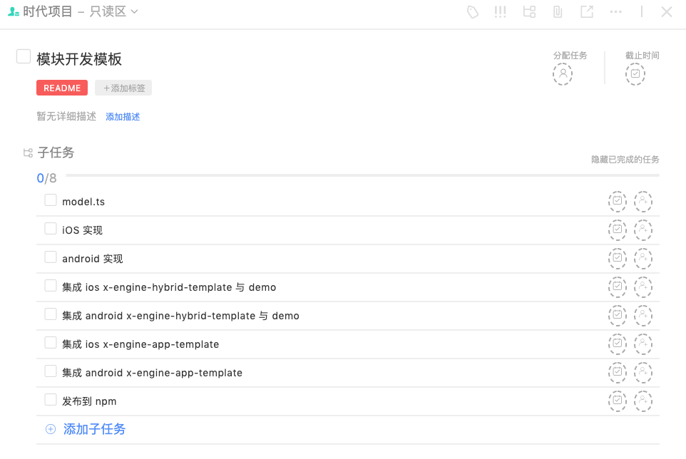

## 目标

**App-C** 与 **App-B** ，以及相关**小程序**

## 开发流程

 

全局: 所有开发流程开始前

 

产品与接口阶段

其中的 mock 服务: 最低限度应该给到接口的参数格式,与返回格式, 以供搭建 mock 服务中间层.

 

 

代码开发阶段

 

测试与发布阶段

### 参与者

具体参与者如下图所示

产品:      王硕

UI 人员:   王硕

业务开发人员

- 原生开发: 吕冬剑, 李宫, 谢飞, 曹鹏
- 微应用 / uniapp 开发: ?

引擎研发人员: 

 - ios 吕冬剑, 李宫
 - android 谢飞,曹鹏
 - js ?

测试人员:

服务端对接: 

### 流程管理

https://zktyfe.worktile.com/tasks/projects/5f6462d8dd3a677fd8cfba9e

**业务开发模板**

针对某业务开发模块, 任务内的子任务都应该有明确的负责人.

**模块开发模板**

## 依赖资源

### 邻里邦 App-C

[原型地址](https://r3hp3w.axshare.com)
[PRD](https://www.yuque.com/docs/share/02fef444-709f-47aa-9421-65f1966427ea?# 《邻里邦APP（APP-C）产品需求文档（PRD)

### 邻里家 App-B

[原型地址](https://4ye6bk.axshare.com)

### 接口文档

https://yapi.bjrrtx.com/ 
查看用户：test@bjrrtx.com
查看密码：a1111111

### 引擎文档

https://zk4.github.io/x-engine-docs-7006136fb67e0a01f60fab177fe9fddd/#/

### git 仓库

github:     https://github.com/zkty-team/

gitlab 镜像: http://123.56.46.250:7002/

## 技术方案

业务模块入口，功能实现可能是 uniapp，纯网页链接， 微信小程序的某页 ，由[统一路由模块](#统一路由模块) 统一路由。

 

### 开发环境搭建

#### uni 小程序/ 微信小程序

参考 https://www.dcloud.io/hbuilderx.html

### 关键模块

#### 原生错误统计上报模块(todo)

com.zkty.moudle.errorNative

#### h5 错误统计上报模块(todo)

com.zkty.moudle.errorH5

#### 埋点模块 (todo)

神策

com.zkty.module.shencei

#### x-engine 模块 (OK)

com.zkty.module.engine

管理各模块,负责注册发现,与注册.

#### 极光推送模块 (WIP: 吕冬剑)

com.zkty.module.msgpsuh

按 x-engine 标准模块开发,可配置

#### 网络模块 (OK)

com.zkty.module.network

#### 支付模块 (todo)

com.zkty.module.pay

#### 蓝牙模块(WIP: 李宫,谢飞)

com.zkty.module.bluetooth

#### 导航模块 (OK)

com.zkty.module.nav

  

外部需求:

参看: [opensdk 接入指南](https://developers.weixin.qq.com/doc/oplatform/Mobile_App/Access_Guide/iOS.html)

#### 广播模块 (todo)

- 统一路由 uni 转发模块

  将 uni 里的统一路由的参数转到,统一路由模块处理.

### 统一样式代码(低优先)

由于功能入口涉及到 h5, 微应用，uniapp 的混编。

微应用与 h5,以及 uniapp 在样式上应该有一套统一的 css，来表达一些公共 UI，如按钮，弹窗。

### 业务实现方案

#### app-c

| 业务模块 | 实现方案            |
| ------------ | ----------------- |
| 首页前的页面 | native            |
| 首页-我的    | native            |
| 首页-开门    | microApp |
| 首页-商城    | h5 链接           |
| 首页-服务    | h5 链接           |

#### app-b

TODO

#### 小程序

TODO

## 里程碑输出

### app-b / app-c

#### 测试包

每完成一个业务模块，会提供一个测试的包。

统一为蒲公英的测试下载地址。（iOS  测试人员需要提供 UUID）

#### 上线

- iOS 应用： 开发人员提交到 app store，由运营人员上线
- android 应用： 开发人员将生产 apk 给到运营人员，由运营人员上线

### 小程序

#### 测试

测试人员提供，微信 id 号，开发人员在完成业务模块后，将体验测试版给到测试人员（二维码）。

#### 上线

开发人员提交小程序到微信平台，由运营人员上线

## 质量标准

### 开发标准

移动平台兼容性 ？

android ?

iOS ?

### 线上标准

bug 率 ？

