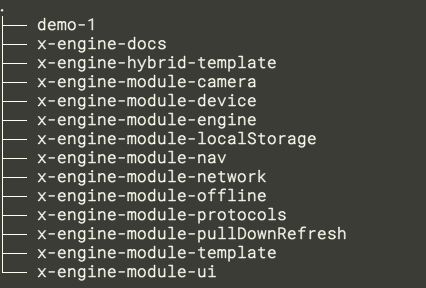

管理员: 刘正青

必须的能力:

翻墙能力. 

## 项目管理

注册 worktile: https://zktyfe.worktile.com/signup?token=48c987629c754e928d8edd2bc1044716  

## 代码管理

将 github 账号交给 @管理员, 拉进开发组.

文档: https://zk4.github.io/x-engine-docs-7006136fb67e0a01f60fab177fe9fddd/

代码仓库: https://github.com/zkty-team

拉取工作目录到本地, (必须保持在都在同级)

 

