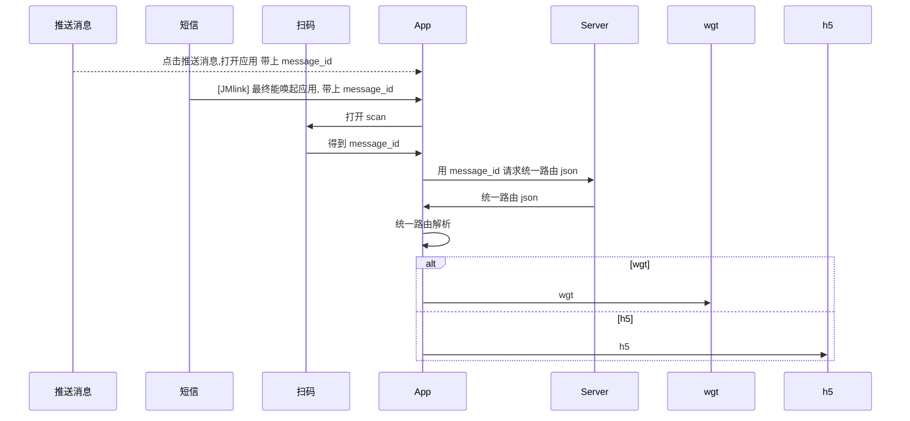
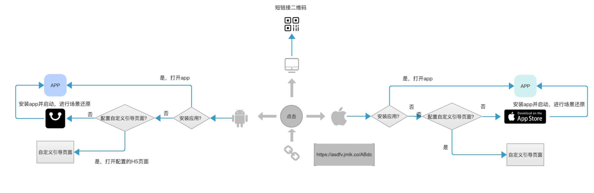

## 扫码与推送与短信

``` mermaid
sequenceDiagram
		participant O as 推送消息
		participant sms as 短信
		participant scan as 扫码
		participant A as App
    participant S as Server
    participant wgt
    participant h5

    O-->>A: 点击推送消息,打开应用 带上 message_id
    sms->>A: [JMlink] 最终能唤起应用, 带上 message_id
    A->>scan:打开 scan
    scan->>A:得到 message_id 
    A->>S : 用 message_id 请求统一路由 json
    S->>A: 统一路由 json
    A->>A:　统一路由解析
    alt wgt  
		A->>wgt: wgt　 
		else h5
		A->>h5: h5
		end
```

JMlink? 

对接极光 https://docs.jiguang.cn/jmlink/guideline/intro/

 

