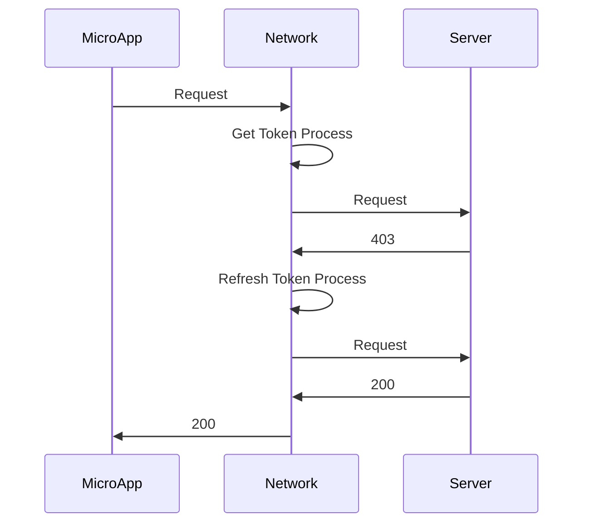
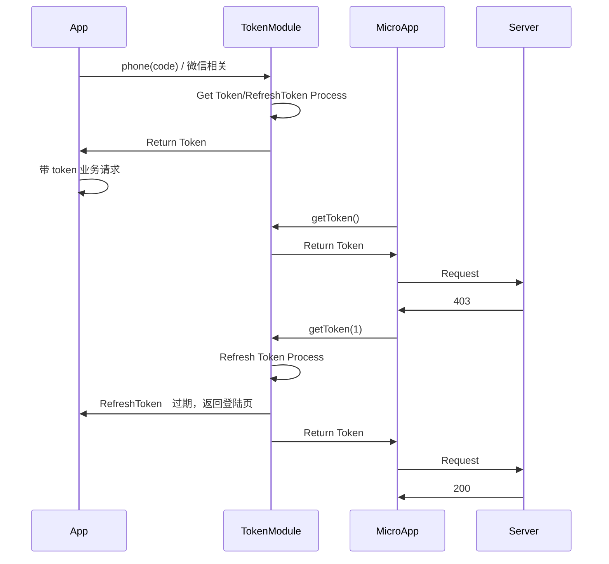

##　当前问题

业务将会污染网络模块，两种隔离业务的方案，

1.　通过 js　传入业务登陆逻辑。
2.　将业务逻辑单独模块化。（当前解决方案）

``` mermaid
sequenceDiagram
    participant MicroApp
    participant Network
    participant Server
    
    MicroApp->>Network: Request
    Network->>Network: Get Token Process


    Network->>Server: Request
    
    Server->>Network: 403
    Network->>Network: Refresh Token Process
    Network->>Server: Request
		Server->>Network: 200
		Network->>MicroApp: 200

```

## 将业务逻辑单独模块化 （当前解决方案）

x-engine-module-timestoken

```mermaid
sequenceDiagram
		participant App
    participant TokenModule
    participant MicroApp
    participant Server
    App->>TokenModule: phone(code) / 微信相关
    TokenModule->>TokenModule: Get Token/RefreshToken Process
    TokenModule->>App:Return Token
    App->>App: 带 token 业务请求
    MicroApp->>TokenModule:getToken()
    TokenModule->>MicroApp:Return Token
    MicroApp->>Server: Request
    Server->>MicroApp: 403
    MicroApp->>TokenModule : getToken(1)
    TokenModule->>TokenModule:Refresh Token Process
    TokenModule->>App:　RefreshToken　过期，返回登陆页
    TokenModule->>MicroApp:Return Token
    MicroApp->>Server: Request
    Server->>MicroApp: 200
```

