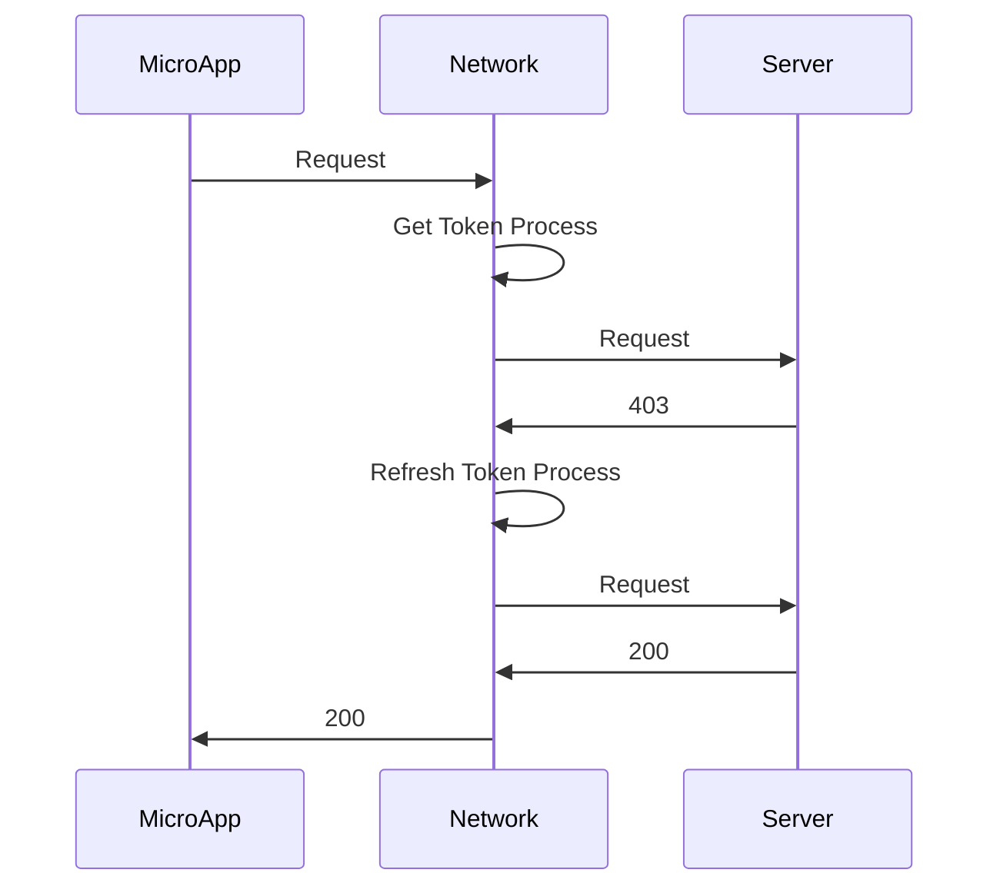
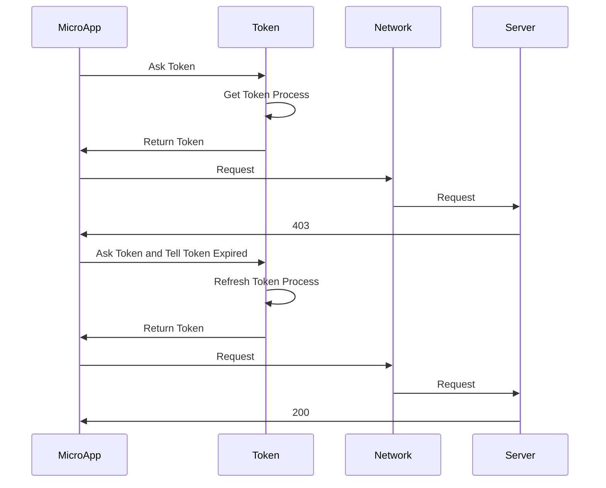

##　由网络处理

如果将业务耦合进通用模块不太科学，那怎么将Get Token Process 动态传入模块？JS？

``` mermaid
sequenceDiagram
    participant MicroApp
    participant Network
    participant Server
    
    MicroApp->>Network: Request
    Network->>Network: Get Token Process


    Network->>Server: Request
    
    Server->>Network: 403
    Network->>Network: Refresh Token Process
    Network->>Server: Request
		Server->>Network: 200
		Network->>MicroApp: 200

```

## 增加 Token业务模块

```mermaid
sequenceDiagram
    participant MicroApp
    participant Token
    participant Network
    participant Server
    MicroApp->>Token:Ask Token
    Token->>Token:Get Token Process
    Token->>MicroApp:Return Token
    MicroApp->>Network: Request
    Network->>Server: Request
    Server->>MicroApp: 403
    MicroApp->>Token : Ask Token and Tell Token Expired
    Token->>Token:Refresh Token Process
    Token->>MicroApp:Return Token
    MicroApp->>Network: Request
    Network->>Server: Request
    Server->>MicroApp: 200


```

