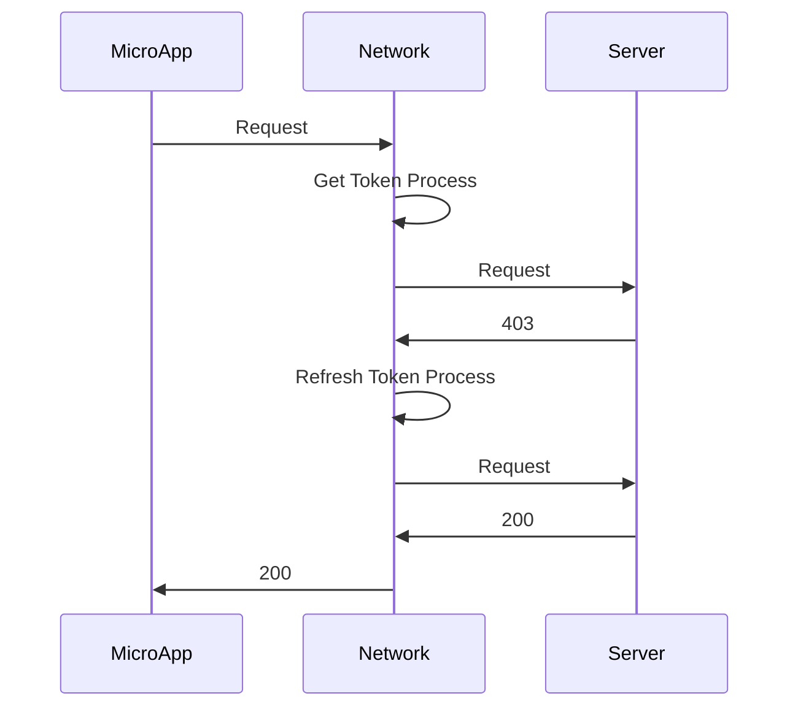
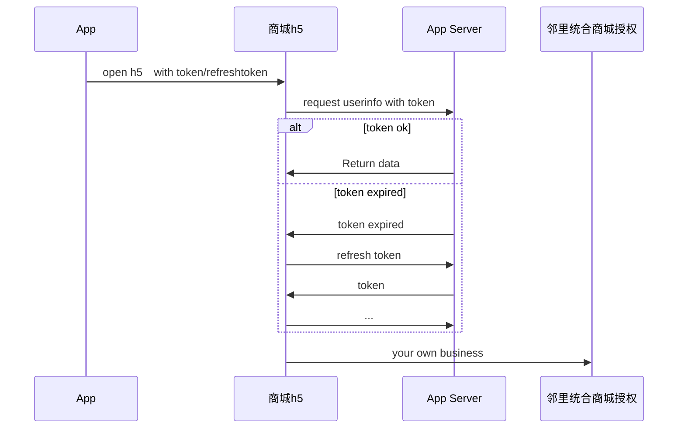
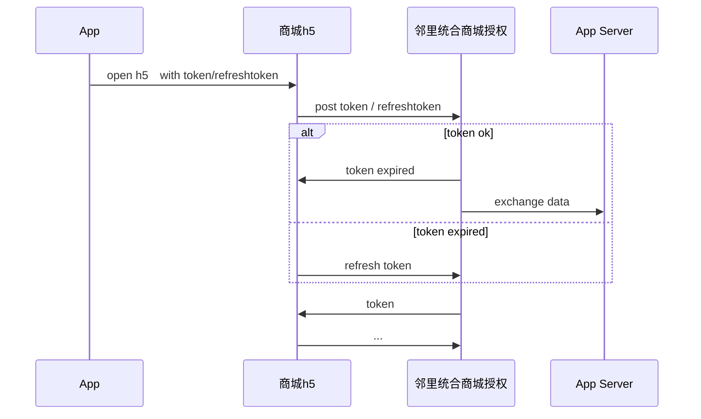
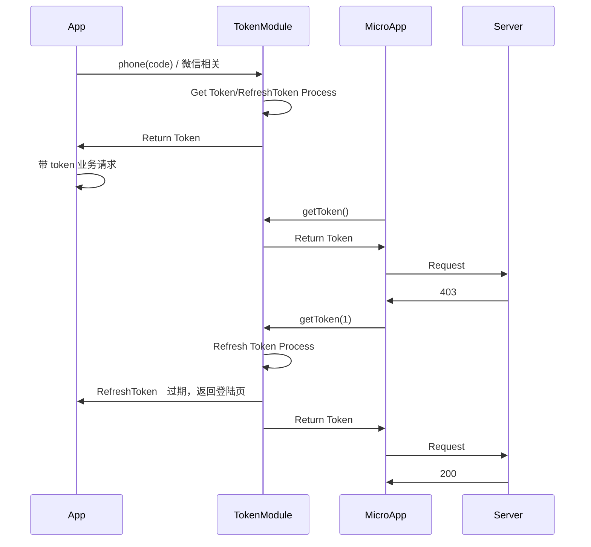

##　当前问题

业务将会污染网络模块，两种隔离业务的方案，

1.　通过 js　传入业务登陆逻辑。
2.　将业务逻辑单独模块化。（当前解决方案）

``` mermaid
sequenceDiagram
    participant MicroApp
    participant Network
    participant Server
    
    MicroApp->>Network: Request
    Network->>Network: Get Token Process


    Network->>Server: Request
    
    Server->>Network: 403
    Network->>Network: Refresh Token Process
    Network->>Server: Request
		Server->>Network: 200
		Network->>MicroApp: 200

```

## 方案 1：h5 方案

```mermaid
sequenceDiagram
		participant App
    participant 商城h5
    participant App Server
    participant 邻里统合商城授权


    App->>商城h5: open h5　with token/refreshtoken
    商城h5->>App Server: request userinfo with token
    alt token ok
    App Server->>商城h5:Return data
    else token expired
    App Server->>商城h5: token expired
    商城h5->>App Server: refresh token
    App Server->>商城h5: token 
    商城h5->>App Server: ...
    end
    商城h5->>邻里统合商城授权: your own business


```

``` mermaid
sequenceDiagram
		participant App
    participant 商城h5
    participant 邻里统合商城授权
		participant App Server

    App->>商城h5: open h5　with token/refreshtoken
 
    商城h5->>邻里统合商城授权: post token / refreshtoken
    alt token ok   
    邻里统合商城授权->>商城h5: token expired
    邻里统合商城授权->>App Server: exchange data
    else token expired
    商城h5->>邻里统合商城授权: refresh token
    end
    邻里统合商城授权->>商城h5: token 
    商城h5->>邻里统合商城授权: ...
    


```

## 方案 2：将业务逻辑单独模块化 

x-engine-module-timestoken

```mermaid
sequenceDiagram
		participant App
    participant TokenModule
    participant MicroApp
    participant Server
    App->>TokenModule: phone(code) / 微信相关
    TokenModule->>TokenModule: Get Token/RefreshToken Process
    TokenModule->>App:Return Token
    App->>App: 带 token 业务请求
    MicroApp->>TokenModule:getToken()
    TokenModule->>MicroApp:Return Token
    MicroApp->>Server: Request
    Server->>MicroApp: 403
    MicroApp->>TokenModule : getToken(1)
    TokenModule->>TokenModule:Refresh Token Process
    TokenModule->>App:　RefreshToken　过期，返回登陆页
    TokenModule->>MicroApp:Return Token
    MicroApp->>Server: Request
    Server->>MicroApp: 200
```

