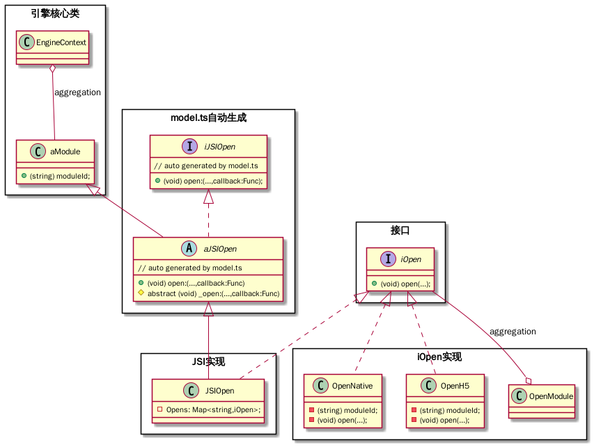

路由（router） 2.0. router 将废弃。

## 类图

- 引擎核心类： 

  各模块都将依赖

- model.ts 自动生成：

  将由 model.ts 通过 x-cli 生成

  i 代表 interface

  a 代表 abstract class

  JSI 代表 Javascript Interface

  > 要注意，在 iOS 里，扫描的是 aJSIOpen。 个中原因，oc 语言不支持重载。

- JSI 实现

  实现带下划线的抽象类方法

- 接口 与 iOpen 实现

  这两者可以独立由原生模块机制管理。